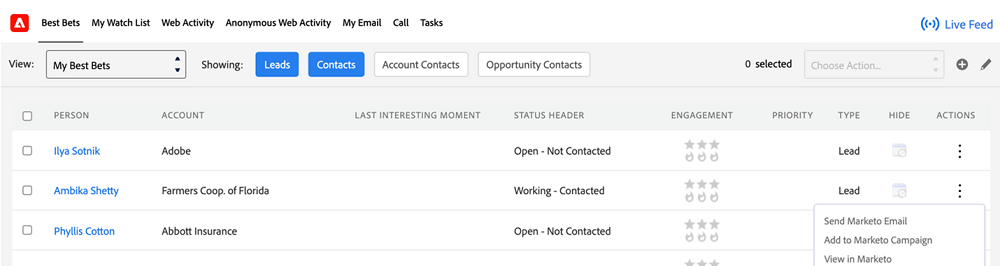

# 在Sales Insight中選擇作業 {#choose-an-action-in-sales-insight}

下列動作可從Salesforce Classic和Lightning的Sales Insight下拉式清單中取得：

* 傳送Marketo電子郵件
* 新增至Marketo Campaign
* 新增至監看清單

這些功能的每一個都可從下列位置存取：

**單一動作的頁面配置**

* 潛在客戶配置面板：單一動作，並可由使用者設定檔控制
* 聯絡人版面面板：單一動作，可由使用者設定檔控制
* 銷售機會配置按鈕：單一動作且無法由使用者設定檔控制
* 連絡人版面配置按鈕：單一動作且無法由使用者設定檔控制

  

**含群組動作的頁面配置**

* 帳戶版面配置面板：群組動作，並可由使用者設定檔控制
* 機會版面配置面板：群組動作，並可由使用者設定檔控制

  

**最佳化索引標籤**

* 最佳化大量動作標籤：群組動作，可由使用者設定檔控制

  

* 最佳的內嵌動作標籤：單一動作，可由使用者設定檔控制

  

**含有大量動作的清單檢視**

* 潛在客戶清單檢視：大量動作，且無法由使用者設定檔控制
* 連絡人清單檢視：大量動作，無法由使用者設定檔控制

  
