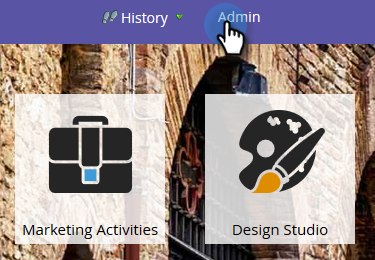
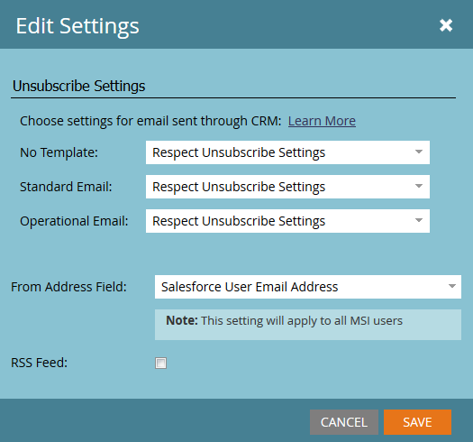

# 在Marketo Sales Insight中設定取消訂閱頁尾 {#configure-unsubscribe-footers-in-marketo-sales-insight}

銷售電子郵件會自動將取消訂閱的頁尾放在最底部。 不過，您可以根據需求調整設定。

>[!NOTE]
>
>**需要管理權限**

>[!NOTE]
>
>**定義**
>
>**銷售電子郵件** 是從Sales Insight傳送的(不包含從Marketo Outlook外掛程式傳送的)。

1. 前往 **管理** 的上界。

   

1. 按一下 **Sales Insight**，然後 **編輯設定**.

   

   有數個選項。 首先，讓我們來了解您可針對哪些電子郵件變更設定。

   

   * **無模板**  — 由銷售用戶手動合成。
   * **標準電子郵件**  — 根據範本的電子郵件。
   * **操作電子郵件**  — 忽略「取消訂閱」、「暫停行銷」和「通訊限制」（無論如何傳送）的電子郵件。

   您可以選擇為每種類型設定不同的行為。

   >[!CAUTION]
   >
   >**遵守取消訂閱設定**:即使已發佈的電子郵件「可操作」，取消訂閱的銷售機會也不會收到電子郵件
   >
   >**忽略取消訂閱設定**:取消訂閱的銷售機會將收到電子郵件

1. 進行您想要的變更，然後按一下 **儲存**.

   >[!TIP]
   >
   >最後兩個選項可讓您根據收件者人數（大於1或大於5），以動態方式包含/排除取消訂閱的頁尾。

   

哇！ 有點複雜，但很靈活，對吧？
