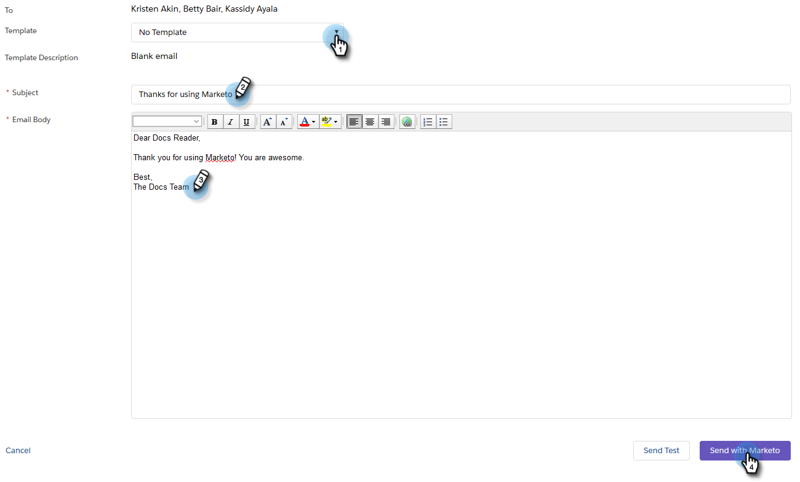

# 傳送電子郵件至Marketo Sales Insight中的多個記錄{#send-an-email-to-multiple-records-in-marketo-sales-insight}

使用Marketo Sales Insight，將Marketo電子郵件傳送給多人，非常簡單。 我們開始吧。

1. 在Salesforce中，按一下&#x200B;**Leads**&#x200B;或&#x200B;**Contacts**。

   

1. 按一下&#x200B;**Go**&#x200B;查看所有未結銷售線索。

   

1. 在清單檢視中，勾選您要傳送電子郵件給的所有潛在客戶／聯絡人，然後按一下「傳送行銷人員電子郵件(classic)」**。**

   

   >[!NOTE]
   >
   >如果您使用Salesforce Lightning，按鈕會顯示「傳送行銷人員電子郵件(lightning)」**。**

   >[!TIP]
   >
   >沒看到按鈕嗎？ 請確定您已將[行銷人員按鈕新增至清單檢視](/help/marketo/product-docs/marketo-sales-insight/msi-for-salesforce/features/bulk-actions/add-marketo-sales-insight-tab-and-buttons-to-salesforce.md)。

1. 繼續撰寫您的電子郵件。 完成時，按一下「與Marketo一起傳送」。****

   

   >[!TIP]
   >
   >您可以[將電子郵件發佈至Sales Insight](/help/marketo/product-docs/marketo-sales-insight/msi-for-salesforce/features/actions-in-the-msi-panel/send-marketo-email/publish-an-email-to-sales-insight.md)並從這些電子郵件中選擇。

   >[!NOTE]
   >
   >您一次最多可傳送200封行銷人員電子郵件。
