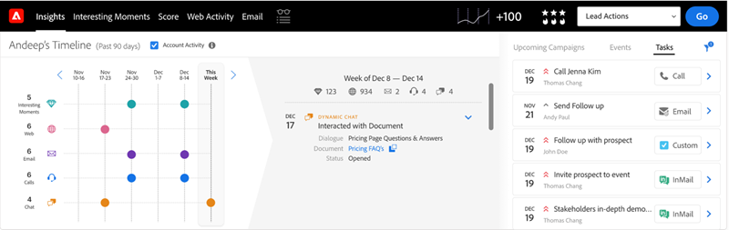

# Dynamic Chat整合 {#dynamic-chat-integration}

進一步瞭解Dynamic Chat與Sales Insight的整合。

>[!PREREQUISITES]
>
>* 您的Sales Insight SFDC套件必須是版本 [1.9或更新版本](/help/marketo/product-docs/marketo-sales-insight/msi-for-salesforce/upgrading/upgrading-your-msi-package.md){target="_blank"}
>
>* 您必須擁有 [Dynamic Chat整合](/help/marketo/product-docs/demand-generation/dynamic-chat/dynamic-chat-overview.md){target="_blank"} 設定

## Marketo Sales Insight設定標籤 {#marketo-sales-insight-configuration-tab}

請依照下列步驟來啟用Dynamic Chat整合。

1. 登入您的Salesforce帳戶，按一下標籤列尾端的+ ，然後按一下 **Marketo銷售分析設定**.

1. 按一下以展開「Visualforce面板」。

   

1. 選取 **啟用Dynamic Chat資料** 核取方塊。

   

## 功能概述 {#feature-overview}

Sales Insight使用者可以利用以下Dynamic Chat活動……

參與對話方塊：當訪客點按聊天機器人並參與對話方塊時，登入Marketo並填入Sales Insight。

* 對話名稱
* 頁面 URL
* 狀態（已啟動/已捨棄/已完成）

已排程約會：當訪客透過聊天機器人成功排程約會時，登入Marketo並在Sales Insight中填入。

* 對話名稱
* 專員
* 頁面 URL
* 排程日期（插入日期和時間戳記）
* 狀態（已排程、已重新排程、已取消）

已達成目標：當訪客達成任何對話方塊流程中的目標時，登入Marketo並填入Sales Insight。

* 對話名稱
* 目標名稱
* 頁面 URL

與檔案互動：訪客與透過聊天機器人共用的檔案互動時，登入Marketo並填入Sales Insight。

* 對話名稱
* 文件
* 狀態

可在見解儀表板中使用聊天活動。

Lead和Contact面板中提供Chat標籤。 其中包括「活動型別」、「對話方塊名稱」和「日期」欄。

您可以按一下活動型別，以進一步瞭解該活動型別。

同樣地，「帳戶」和「商機」面板包含「名稱」、「活動型別」、「對話方塊名稱」和「日期」欄。

「聊天」標籤也包含在您的「全域Marketo」標籤中。 它包含三種活動型別（參與對話方塊、排程約會、達成目標），以及下列欄：

* 個人
* 帳戶
* 活動型別（參與對話方塊、排程約會、達成目標）
* 對話名稱
* 日期與時間戳記

同樣地，您可以按一下活動型別以進一步瞭解該活動型別。

>[!NOTE]
>
>如果「啟用Dynamic Chat資料」核取方塊已停用，則會停用下列功能：
>
>* 前瞻分析控制面板（智慧格線和每週清單檢視）中包含「聊天」活動的列
>* Lead、Contact、Account和Opportunity面板中的Chat索引標籤
>* 「全域Marketo」標籤中的「聊天」標籤
>
>不能只停用其中一項功能。

