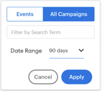

# Insights儀表板功能概述 {#insights-dashboard-feature-overview}

瞭解有關Sales Insights儀表板中可用功能的詳細資訊。

>[!PREREQUISITES]
>
>您必須擁有最新的MSI SFDC包和 [配置](/help/marketo/product-docs/marketo-sales-insight/msi-for-salesforce/configuration/configuration-for-existing-customers.md)。

## 聯繫人佈局 {#contact-layout}

**嚙合速度網格**

* 此智慧網包括過去90天內的有趣時刻、電子郵件和Web活動
* 用戶可以選擇「顯示帳戶」活動，這將在聯繫人視圖中將所有帳戶級別的「有趣時刻」、「電子郵件」和「Web活動」層
* 用戶可以突出顯示特定周，以便查看該周內的活動
* 預設視圖：已選擇當前周

**項目追溯和摘要**

* 深入查看活動卡以瞭解有趣的時刻、電子郵件和Web活動
* 有趣的瞬間活動卡 — 包括訂閱選項
* 電子郵件活動卡 — 包括預覽選項
* Web活動卡 — 包括按一下連結的功能
* 每週摘要欄將顯示該周的有趣時刻、電子郵件和Web活動。 每個表徵圖都可按一下，可用作顯示特定活動的篩選器
* 預設視圖：這是當前視圖的活動清單

**即將發送的電子郵件活動和事件**

「電子郵件市場活動」標籤：

* 包括作為未來90天內計畫的電子郵件計畫或預設計畫的一部分的市場活動
* 不特定於聯繫人/潛在顧客(即，市場活動清單是在Marketo實例中計畫的所有電子郵件市場活動的通用清單)。 所有銷售線索、聯繫人、帳戶和業務機會面板中的市場活動清單將相同
* 如果市場活動重複出現，使其在接下來的90天內運行三次以上，則在任何給定時間點(與Marketo的行為類似)都只顯示接下來的三次運行
* 此部分中的活動詳細資訊卡將具有預覽選項。 如果流包含多個發送電子郵件步驟，則所有電子郵件都可以預覽。 在發送電子郵件流步驟中，如果有多個「電子郵件選項」，則預設選項將可用於預覽
* 篩選器包括「搜索」和「日期範圍」

事件頁籤：

* 包括計畫在未來90天內進行的事件程式
* 使用篩選器選項查看所有事件/邀請的事件（基於管理設定）
* 選擇邀請的活動將顯示已邀請特定聯繫人的活動以及成員狀態
* 選擇所有事件將顯示未來90天內計畫的事件清單
* 此部分中的活動詳細資訊卡具有預覽選項
* 篩選器包括「搜索」、「僅顯示邀請的事件」和「日期範圍」

## 銷售線索佈局 {#lead-layout}

**嚙合速度網格**

* 此智慧網包括過去90天內的有趣時刻、電子郵件和Web活動
* 用戶可以突出顯示特定周，以便查看該周內的活動
* 預設視圖：已選擇當前周
* 「顯示帳戶活動」功能在銷售線索上不可用，因為在將其轉換為聯繫人之前，它不是Salesforce中任何帳戶的一部分

**項目追溯和摘要**

* 深入查看活動卡，查看有趣的時刻、電子郵件和Web活動
* 有趣的瞬間活動卡 — 包括訂閱選項
* 電子郵件活動卡 — 包括預覽選項
* Web活動卡 — 包括按一下連結的功能
* 每週摘要欄將顯示該周的有趣時刻、電子郵件和Web活動。 每個表徵圖都可按一下，可用作顯示特定活動的篩選器
* 預設視圖：這是當前視圖的活動清單

**即將發送的電子郵件活動和事件：**

「電子郵件市場活動」標籤：

* 包括作為未來90天內計畫的電子郵件計畫或預設計畫的一部分的市場活動
* 不特定於聯繫人/潛在顧客(即，市場活動清單是在Marketo實例中計畫的所有電子郵件市場活動的通用清單)。 所有銷售線索、聯繫人、帳戶和業務機會面板中的市場活動清單將相同
* 如果市場活動重複出現，使其在接下來的90天內運行三次以上，則在任何給定時間點(與Marketo的行為類似)都只顯示接下來的三次運行
* 此部分中的活動詳細資訊卡將具有預覽選項。 如果流包含多個發送電子郵件步驟，則所有電子郵件都可以預覽。 在發送電子郵件流步驟中，如果有多個「電子郵件選項」，則預設選項將可用於預覽
* 篩選器包括「搜索」和「日期範圍」

事件頁籤：

* 包括計畫在未來90天內進行的事件程式
* 使用篩選器選項查看所有事件/邀請的事件（基於管理設定）
* 選擇邀請的活動將顯示已邀請特定聯繫人的活動以及成員狀態
* 選擇所有事件將顯示未來90天內計畫的事件清單
* 此部分中的活動詳細資訊卡具有預覽選項
* 篩選器包括「搜索」、「僅顯示邀請的事件」和「日期範圍」

## 帳戶佈局 {#account-layout}

**嚙合速度網格**

* 此智慧網包括過去90天內帳戶中所有聯繫人的有趣時刻、電子郵件和Web活動
* 用戶可以突出顯示特定周，以便查看該周內的活動
* 預設視圖：已選擇當前周

**項目追溯和摘要**

* 深入查看「有趣時刻」、「電子郵件」和「Web活動」的活動卡，包括聯繫人姓名
* 有趣的瞬間活動卡 — 包括訂閱選項
* 電子郵件活動卡 — 包括預覽選項
* Web活動卡 — 包括按一下連結的功能
* 每週摘要欄將顯示該周的有趣時刻、電子郵件和Web活動。 每個表徵圖都可按一下，可用作顯示特定活動的篩選器
* 預設視圖：這是當前視圖的活動清單

**即將發送的電子郵件活動和事件**

「電子郵件市場活動」標籤：

* 包括作為未來90天內計畫的電子郵件計畫或預設計畫的一部分的市場活動
* 不特定於聯繫人/潛在顧客(即，市場活動清單是在Marketo實例中計畫的所有電子郵件市場活動的通用清單)。 所有銷售線索、聯繫人、帳戶和業務機會面板中的市場活動清單將相同
* 如果市場活動重複出現，使其在接下來的90天內運行三次以上，則在任何給定時間點(與Marketo的行為類似)都只顯示接下來的三次運行
* 此部分中的活動詳細資訊卡將具有預覽選項。 如果流包含多個發送電子郵件步驟，則所有電子郵件都可以預覽。 在發送電子郵件流步驟中，如果有多個「電子郵件選項」，則預設選項將可用於預覽
* 篩選器包括「搜索」和「日期範圍」

事件頁籤：

* 包括計畫在未來90天內進行的事件程式
* 使用篩選器選項查看所有事件/邀請的事件（基於管理設定）
* 選擇邀請的活動將顯示已邀請特定聯繫人的活動以及成員狀態
* 選擇所有事件將顯示未來90天內計畫的事件清單
* 此部分中的活動詳細資訊卡具有預覽選項
* 篩選器包括「搜索」、「僅顯示邀請的事件」和「日期範圍」

## 機會版式 {#opportunity-layout}

**嚙合速度網格**

* 此智慧網包括Opportunity中所有聯繫人在過去90天中的有趣時刻、電子郵件和Web活動
* 用戶可以突出顯示特定周，以便查看該周內的活動
* 預設視圖：已選擇當前周

**項目追溯和摘要**

* 深入查看「有趣時刻」、「電子郵件」和「Web活動」的活動卡，包括聯繫人姓名
* 有趣的瞬間活動卡 — 包括訂閱選項
* 電子郵件活動卡 — 包括預覽選項
* Web活動卡 — 包括按一下連結的功能
* 每週摘要欄將顯示該周的有趣時刻、電子郵件和Web活動。 每個表徵圖都可按一下，可用作顯示特定活動的篩選器
* 預設視圖：這是當前視圖的活動清單

**即將發送的電子郵件活動和事件** 「電子郵件市場活動」標籤：

* 包括作為未來90天內計畫的電子郵件計畫或預設計畫的一部分的市場活動
* 不特定於聯繫人/潛在顧客(即，市場活動清單是在Marketo實例中計畫的所有電子郵件市場活動的通用清單)。 所有銷售線索、聯繫人、帳戶和業務機會面板中的市場活動清單將相同
* 如果市場活動重複出現，使其在接下來的90天內運行三次以上，則在任何給定時間點(與Marketo的行為類似)都只顯示接下來的三次運行
* 此部分中的活動詳細資訊卡將具有預覽選項。 如果流包含多個發送電子郵件步驟，則所有電子郵件都可以預覽。 在發送電子郵件流步驟中，如果有多個「電子郵件選項」，則預設選項將可用於預覽
* 篩選器包括「搜索」和「日期範圍」

事件頁籤：

* 包括計畫在未來90天內進行的事件程式
* 使用篩選器選項查看所有事件/邀請的事件（基於管理設定）
* 選擇邀請的活動將顯示已邀請特定聯繫人的活動以及成員狀態
* 選擇所有事件將顯示未來90天內計畫的事件清單
* 此部分中的活動詳細資訊卡具有預覽選項
* 篩選器包括「搜索」、「僅顯示邀請的事件」和「日期範圍」

>[!NOTE]
>
>如果您的Account或Opportunity有800多個聯繫人，控制板將不顯示任何資料。 但是，您可以訪問單個聯繫人查看他們的見解和參與。 如果您的帳戶有800個以上的聯繫人，則「顯示帳戶級別活動」將被禁用。
