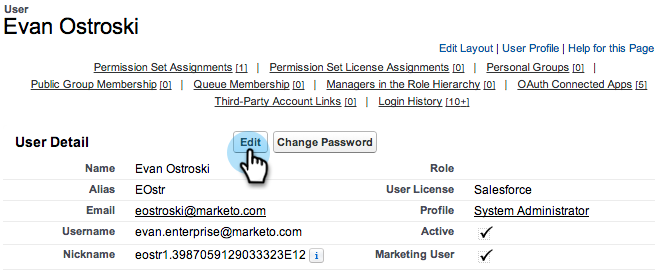
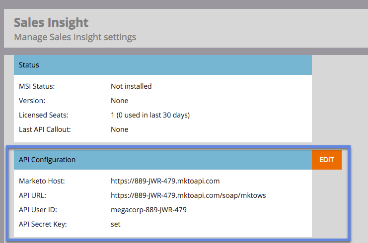

# 為Salesforce中的多語言支援準備Sales Insight {#prepare-sales-insight-for-multi-lingual-support-in-salesforce}

>[!NOTE]
>
>**需要管理員許可權**

Marketo Sales Insight是以語言儲存。 因此，如果您希望它適用於多種語言，則必須分別輸入每種語言的認證。

>[!NOTE]
>
>Sales Insight目前支援：
>
>* 英文
>* 法文
>* 德文
>
>任何其他語言預設為英文。

## 為Marketo Sales Insight新增語言 {#adding-a-new-language-for-marketo-sales-insight}

1. 登入Salesforce。 在右上角名稱下方的下拉式清單中，按一下 **設定**.

   

1. 下 **我的個人資訊**，按一下 **個人資訊**.

   

1. 按一下 **編輯**.

   

1. 選取語言並按一下 **儲存**.

   

1. 您的Salesforce介面現在使用選取的語言。 您可以按一下 **+** 圖示以檢視所有可用的標籤。

   

1. 按一下 **設定Marketo Sales Insight** （使用選取的語言）。

   

1. 前往Marketo。 找出您的 [Marketo Sales Insight **API設定** 詳細資料](/help/marketo/product-docs/marketo-sales-insight/msi-for-salesforce/configuration/configure-marketo-sales-insight-in-salesforce-enterprise-unlimited.md#configure-marketo-sales-insight).

   

1. 輸入Marketo的API詳細資料，然後按一下 **儲存**.

   

## 將Salesforce變更為英文 {#change-salesforce-back-to-english}

當您完成自訂Salesforce組織時，以下說明如何將您的個人設定傳回英文。

>[!NOTE]
>
>下列熒幕擷取畫面為法文，並附有英文指示。  您會看到相同的畫面，其中包含您在上一步驟中選取之語言的文字。

1. 在您的名稱底下，按一下 **設定**.

1. 按一下 **個人資訊** 在 **我的個人資訊**.

   

1. 按一下 **編輯**.

   

1. 選取 **英文** 從「語言」下拉式清單，然後按一下 **儲存**.

   

   現在您的Salesforce恢復使用英文！
