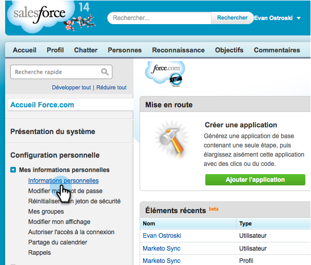

# 讓銷售洞察在 Salesforce 中能夠提供多語言支援 {#prepare-sales-insight-for-multi-lingual-support-in-salesforce}

>[!NOTE]
>
>**需要管理員許可權**

Marketo Sales Insight是依語言儲存。 因此，如果您希望它適用於多種語言，則必須分別輸入每種語言的認證。

>[!NOTE]
>
>[!DNL Sales Insight]目前支援：
>
>* 英文
>* 法文
>* 德文
>
>任何其他語言預設為英文。

## 正在新增[!DNL Marketo Sales Insight]的語言 {#adding-a-new-language-for-marketo-sales-insight}

1. 登入[!DNL Salesforce]。 在右上角名稱下方的下拉式清單中，按一下&#x200B;**[!UICONTROL Setup]**。

   

1. 在&#x200B;**[!UICONTROL My Personal Information]**&#x200B;底下，按一下&#x200B;**[!UICONTROL Personal Information]**。

   

1. 按一下「**[!UICONTROL Edit]**」。

   

1. 選取語言並按一下&#x200B;**[!UICONTROL Save]**。

   

1. 您的[!DNL Salesforce]介面現在使用選取的語言。 您可以按一下&#x200B;**+**&#x200B;圖示以檢視所有可用的標籤。

   

1. 按一下&#x200B;**[!UICONTROL Configure Marketo Sales Insight]** （使用選取的語言）。

   

1. 前往Marketo。 找到您的&#x200B;[[!DNL Marketo Sales Insight] **[!UICONTROL API configuration]**&#x200B;詳細資料](/help/marketo/product-docs/marketo-sales-insight/msi-for-salesforce/configuration/configure-marketo-sales-insight-in-salesforce-enterprise-unlimited.md#configure-marketo-sales-insight)。

   

1. 輸入Marketo的API詳細資料，然後按一下&#x200B;**[!UICONTROL Save]**。

   

## 將[!DNL Salesforce]變更回英文 {#change-salesforce-back-to-english}

當您完成自訂[!DNL Salesforce]組織時，以下說明如何將您的個人設定傳回英文。

>[!NOTE]
>
>下列熒幕擷取畫面為法文，並附有英文指示。  您會看到與您在上一步中選取之語言文字相同的畫面。

1. 在您的名稱下，按一下&#x200B;**[!UICONTROL Setup]**。

1. 按一下&#x200B;**[!UICONTROL Personal Information]**&#x200B;下的&#x200B;**[!UICONTROL My Personal Information]**。

   

1. 按一下「**[!UICONTROL Edit]**」。

   

1. 從[語言]下拉式清單中選取&#x200B;**[!UICONTROL English]**，然後按一下&#x200B;**[!UICONTROL Save]**。

   

   現在您的[!DNL Salesforce]已恢復為英文！
