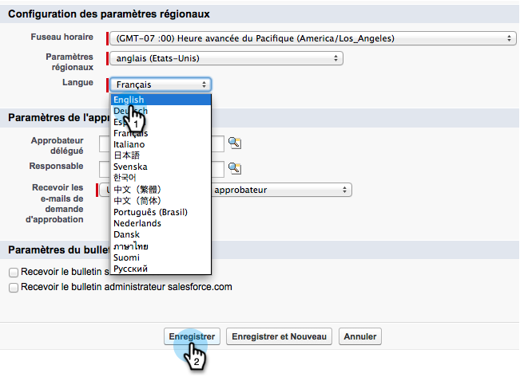

# 在Salesforce中為多語言支援準備銷售分析 {#prepare-sales-insight-for-multi-lingual-support-in-salesforce}

>[!NOTE]
>
>**需要管理權限**

Marketo Sales Insight是依語言儲存。 因此，如果希望它適用於多種語言，則必須分別輸入每種語言的憑據。

>[!NOTE]
>
>Sales Insight目前支援：
>
>* 英文
>* 法文
>* 德文
>
>任何其他語言預設為英文。

## 新增Marketo Sales Insight的語言 {#adding-a-new-language-for-marketo-sales-insight}

1. 登入Salesforce。 在右上角您名稱下的下拉式清單中，按一下 **設定**.

   

1. 在 **我的個人資訊**，按一下 **個人資訊**.

   

1. 按一下 **編輯**.

   

1. 選取語言，然後按一下 **儲存**.

   

1. 您的Salesforce介面現在使用所選語言。 您可以按一下 **+** 表徵圖以查看所有可用頁簽。

   

1. 按一下 **設定Marketo Sales Insight** （使用所選語言）。

   

1. 去Marketo。 找出您的 [Marketo Sales Insight **API設定** 詳細資訊](/help/marketo/product-docs/marketo-sales-insight/msi-for-salesforce/configuration/configure-marketo-sales-insight-in-salesforce-enterprise-unlimited.md#configure-marketo-sales-insight).

   

1. 從Marketo輸入API詳細資訊，然後按一下 **儲存**.

   

## 將Salesforce變回英文 {#change-salesforce-back-to-english}

完成自訂Salesforce組織後，以下說明如何將個人設定傳回英文。

>[!NOTE]
>
>以下螢幕截圖為法文，說明為英文。  您會看到上一步所選語言中文字的相同畫面。

1. 在您的名稱下，按一下 **設定**.

1. 按一下 **個人資訊** 在 **我的個人資訊**.

   

1. 按一下 **編輯**.

   

1. 選擇 **英文** 從「語言」下拉式清單中，按一下 **儲存**.

   

   現在你的Salesforce又用英語了！
