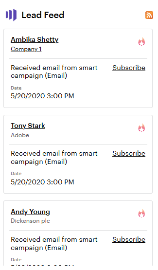

# 使用銷售線索饋送{#using-the-lead-feed}

「銷售線索摘要」是您銷售線索所執行之最新有趣事件清單。 當您按一下「行銷人員」標籤時，會在右側找到它。 它就像RSS或Twitter動態消息——最新的更新位於清單的頂端。 用這個在你還在他們頭腦新鮮的時候，跳到線索上。

>[!NOTE]
>
>銷售線索饋送包括您擁有的銷售線索和您的關注清單中的銷售線索。

## 銷售線索摘要中包含什麼？{#whats-in-the-lead-feed}

銷售線索饋送中的每個項目都是一個有趣的時刻——此銷售線索行銷歷史記錄中值得注意的活動或事件。

在Salesforce中檢視時，每個項目都有：

<table> 
 <colgroup> 
  <col> 
  <col> 
 </colgroup> 
 <tbody> 
  <tr> 
   <td>
項目
</td> 
   <td>
說明
</td> 
  </tr> 
  <tr> 
   <td>
答：潛在客戶／聯絡人
</td> 
   <td>
有這個有趣時刻的人
</td> 
  </tr> 
  <tr> 
   <td>
B.事件類型
</td> 
   <td>
此刻的類別——網頁、電子郵件或里程碑
</td> 
  </tr> 
  <tr> 
   <td>
C.帳戶名稱
</td> 
   <td>
公司名稱
</td> 
  </tr> 
  <tr> 
   <td>
D.時間
</td> 
   <td>
當這個有趣的時刻
</td> 
  </tr> 
  <tr> 
   <td>
E.事件說明
</td> 
   <td>
這個有趣時刻的原因
</td> 
  </tr> 
  <tr> 
   <td>
F.訂閱
</td> 
   <td>
接收此類事件的電子郵件通知
</td> 
  </tr> 
  <tr> 
   <td>
G.星
</td> 
   <td>
此人是最佳賭注（高優先順序）
</td> 
  </tr> 
 </tbody> 
</table>

## 獲取RSS更新{#getting-rss-updates}

您也可以透過RSS饋送取得銷售機會饋送更新。  RSS饋送可讓您接收潛在客戶的更新，即使您未連線至Salesforce。 動態消息與Salesforce中的「銷售線索動態消息」資訊相同，以及下列資訊（如果有）:

* 電子郵件地址
* 電話號碼
* 行動電話
* 傳真號碼
* 公司地址
* 公司URL

>[!NOTE]
>
>貴公司的行銷人員必須[啟用RSS饋送](/help/marketo/product-docs/marketo-sales-insight/msi-for-salesforce/features/msi-configuration-tab/enable-rss-for-sales-insight.md)才能運作。

若要取得RSS更新，您需要兩件事：RSS連結和RSS饋送讀取器。 您可以按一下銷售線索饋送中的RSS圖示，以取得RSS連結：

RSS饋送將出現在新視窗中。 然後，您可以複製RSS饋送的URL，並在RSS閱讀器中使用它。 大部分的瀏覽器都有內建的RSS閱讀器，或者您可以使用您平台專用的RSS閱讀器。
