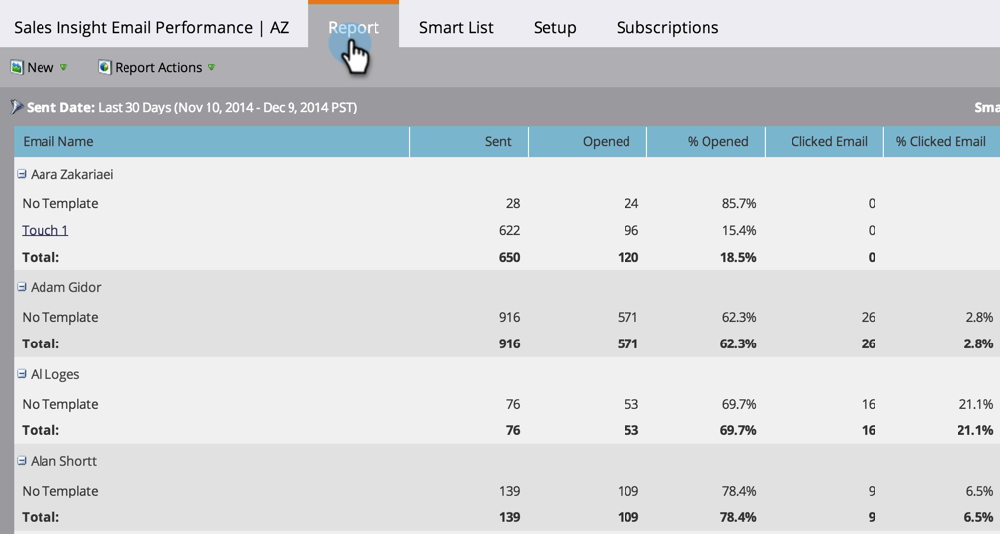

# Sales Insight電子郵件績效報表 {#sales-insight-email-performance-report}

檢視透過Salesforce、Microsoft Dynamics或Gmail或Outlook外掛程式傳送的電子郵件效能。

## 產生報表 {#generate-a-report}

1. 按一下 **Analytics**.

   

1. 按一下 **Sales Insight電子郵件效能**.

   

1. 按一下 **設定** 標籤，然後選擇您想要的值。

   

1. 按一下 **報表** 標籤。

   

   太棒了！ 現在，您可以了解從銷售團隊傳送的電子郵件的執行情況。

   >[!NOTE]
   >
   >系統不會針對透過Sales Insight傳送的電子郵件擷取傳送狀態，且這些狀態不會包含在此報表或活動記錄中。

>[!TIP]
>
>按一下電子郵件的名稱，以在「電子郵件預覽器」中開啟它。

## 按銷售代表分組 {#group-by-sales-rep}

您可以通過更改設定來查看按銷售代表分組的此報告。

1. 按一下 **設定**. 按兩下 **電子郵件**.

   

1. 選擇分組電子郵件依據 **銷售代表**.

   

1. 按一下 **儲存**.

   

1. 按一下 **報表** 標籤。

   

   挺酷的吧？ 現在，您可以看到依銷售代表分組的電子郵件的效能。
