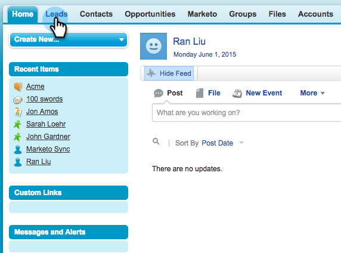

# 向MarketoSales Insight中的多個記錄發送電子郵件 {#send-an-email-to-multiple-records-in-marketo-sales-insight}

使用Marketo銷售洞察器向多個人發送Marketo電子郵件非常容易。 開始吧。

1. 在Salesforce中，按一下 **銷售線索** 或 **聯繫人**。

   

1. 按一下 **開始** 查看所有未結銷售線索。

   

1. 在清單視圖中，檢查要向其發送電子郵件的所有潛在客戶/聯繫人，然後按一下 **發送Marketo電子郵件（經典）**。

   

   >[!NOTE]
   >
   >如果您使用Salesforce Lightning，則按鈕將 **發送Marketo電子郵件（閃電）**。

   >[!TIP]
   >
   >沒看到按鈕嗎？ 確保 [已將Marketo按鈕添加到清單視圖](/help/marketo/product-docs/marketo-sales-insight/msi-for-salesforce/configuration/add-bulk-action-buttons-to-salesforce-classic.md)。

1. 請撰寫電子郵件。 按一下 **與Marketo一起發送** 的子菜單。

   

   >[!TIP]
   >
   >你可以 [將電子郵件發佈到Sales Insight](/help/marketo/product-docs/marketo-sales-insight/msi-for-salesforce/features/actions-in-the-msi-panel/send-marketo-email/publish-an-email-to-sales-insight.md) 從那些郵件中選擇。

   >[!NOTE]
   >
   >您一次最多可以發送200封Marketo電子郵件。
