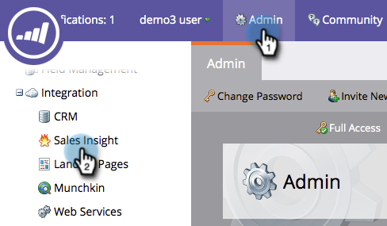

# 自定義星光和火焰 {#customize-stars-and-flames}

Marketo Sales Insight利用明星和火焰來排定銷售線索的優先順序。 Marketo自動決定誰能獲得1-2-3顆恆星/火焰。 不過，您可以修改公式。 方法如下：

>[!AVAILABILITY]
>
>並非所有客戶都購買過此功能。 如需詳細資訊，請連絡您的銷售代表。

>[!NOTE]
>
>**需要管理權限**

1. 在「管理」下，按一下 **Sales Insight**.

1. 在 **銷售機會分數設定** ，按一下 **編輯**.

   

1. 選取 **計分方法** 你自己選擇的。

   >[!NOTE]
   >
   >**定義**
   >
   >**動態**  — 是衍生自 [相對資料](/help/marketo/product-docs/marketo-sales-insight/msi-for-salesforce/features/stars-and-flames/priority-urgency-relative-score-and-best-bets.md). 棒極了。 建議使用此方法。
   >
   >**靜態**  — 可讓您定義確切的分數數字 — 不再有百分比，也不再有秘密的深碟。

   

1. 根據您的喜好編輯百分比方括弧，並 **儲存**.

   >[!TIP]
   >
   >只要編輯開始百分比，Marketo就會計算您的結束百分比！

   

>[!NOTE]
>
>一旦改變，重新計算恆星和火焰的過程需要一些時間。 耐心是一種美德。

甜蜜！ 您只需按照Marketo計算明星和火焰的方式定制，以便更好地滿足您的業務需求。
