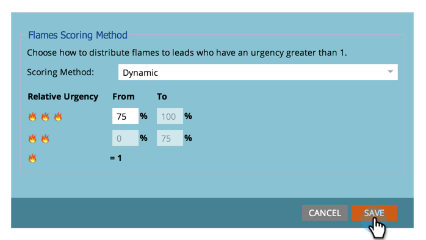

# 設定Sales Insight {#set-score-fields-to-be-used-for-stars-and-flames-in-sales-insight}中用於星形和火焰的分數欄位

>[!NOTE]
>
>**需要管理員權限**

依預設，Marketo Sales Insight會使用&#x200B;**Lead Score**&#x200B;欄位來計算星形和火焰。 但是，如果您想要選擇不同的領域，以下是方法：

>[!TIP]
>
>如果您尚未擁有自訂分數欄位，請以下說明如何建立欄位。

>[!NOTE]
>
>**定義**
>
>* **星**:與其他銷售機會相比，星表代表總銷售機會分數。
>* **火焰**:火焰代表了緊迫性——最近銷售線索的分數變化了多少。

>

1. 在&#x200B;**Admin**&#x200B;下，按一下&#x200B;**Sales Insight**。

   

1. 在&#x200B;**銷售線索計分設定**&#x200B;下，按一下&#x200B;**編輯**。

   

1. 選擇要用於&#x200B;**星**&#x200B;的欄位。

   

1. 選擇要用於&#x200B;**火焰**&#x200B;的欄位。

   

1. 按一下&#x200B;**保存**。

   

   >[!NOTE]
   >
   >重新計算銷售見解需要一些時間。 您稍後可以檢查您的CRM，看看明星和火焰。

   >[!MORELIKETHIS]
   >
   >[優先順序、緊急程度、相對分數和最佳賭注](/help/marketo/product-docs/marketo-sales-insight/msi-for-salesforce/features/stars-and-flames/priority-urgency-relative-score-and-best-bets.md)
