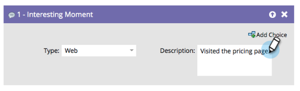

# 關鍵時刻概觀 {#interesting-moments-overview}

您可以使用有趣的時刻流程步驟，讓您的銷售團隊能夠瞭解潛在客戶在Smart Campaign中進行的炫酷行為。

1. 選取您要使用的有趣時刻型別。

   

1. 定義您要讓銷售團隊檢視的文字。

   

>[!TIP]
>
>少&#x200B;**多**。 請與您的銷售團隊合作，確定有趣的時刻確實很有趣。

您也可以在有趣的時刻使用權杖，做出真正實用的動態說明。

>[!MORELIKETHIS]
>
>* [使用有趣的時刻](/help/marketo/product-docs/marketo-sales-insight/msi-for-salesforce/features/tabs-in-the-msi-panel/interesting-moments/using-interesting-moments.md)
>* [有趣時刻的Token](/help/marketo/product-docs/marketo-sales-insight/msi-for-salesforce/features/tabs-in-the-msi-panel/interesting-moments/trigger-tokens-for-interesting-moments.md)
