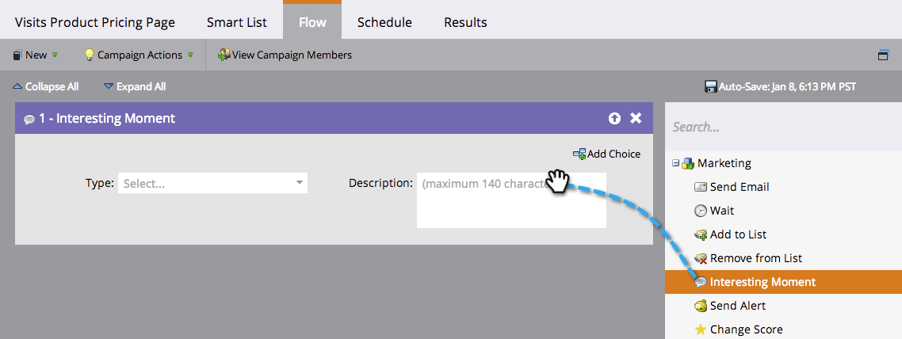
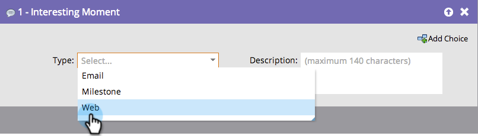

# 使用有趣的時刻 {#using-interesting-moments}

有趣的時刻是透過Marketo Sales Insight應用程式與您的銷售團隊溝通的關鍵。

>[!AVAILABILITY]
>
>這些功能適用於Marketo Sales Insight和 [Marketo Sales Connect](/help/marketo/product-docs/marketo-sales-connect/marketo/interesting-moments-in-sales-connect.md) 僅限客戶。

## 什麼是有趣的時刻？ {#what-is-an-interesting-moment}

這取決於你！ 您決定與您的銷售團隊相關的資訊。 您的銷售團隊可能想知道銷售機會的時間：

* 瀏覽網站上的定價頁面
* 按一下新產品公告電子郵件中的連結
* 要求產品示範

## 如何創造有趣的時刻？  {#how-do-i-create-an-interesting-moment}

1. 選擇 [智慧型行銷活動](/help/marketo/product-docs/core-marketo-concepts/smart-campaigns/understanding-smart-campaigns.md)，若觸發，您的銷售團隊最好會覺得有趣。

   

1. 拖曳至 **有趣的時刻** 流程步驟。

   

1. 選取 **type** （電子郵件、里程碑或網頁）。

   

1. 在 **說明** 欄位，說明此動作為何重要。

   

   >[!NOTE]
   >
   >Marketo也會新增發生的日期以及新增有趣時刻的方式（例如「領導動作>流程步驟」、SOAP API）。

## 怎麼會更有趣？  {#how-can-this-get-even-more-interesting}

代號！ 在說明欄位中新增他們，以提供您的銷售團隊更具體的資訊，例如潛在客戶開啟的電子郵件主旨行，或是由誰傳送。 查看可在 [有趣時刻的代號](/help/marketo/product-docs/marketo-sales-insight/msi-for-salesforce/features/tabs-in-the-msi-panel/interesting-moments/trigger-tokens-for-interesting-moments.md) 字彙表。

>[!TIP]
>
>從五個有趣的時刻開始，然後與您的銷售團隊合作，確定他們想要查看哪些資訊。

## 在Marketo，什麼是有趣的時刻？  {#what-does-an-interesting-moment-look-like-in-marketo}

有趣的時刻會顯示在 [銷售機會的活動記錄](/help/marketo/product-docs/core-marketo-concepts/smart-lists-and-static-lists/managing-people-in-smart-lists/using-the-person-detail-page.md).

## 在Salesforce中，什麼是有趣的時刻？  {#what-does-an-interesting-moment-look-like-in-salesforce}

一旦您 [已安裝Marketo Sales Insight應用程式](/help/marketo/product-docs/marketo-sales-insight/msi-for-salesforce/configuration/configure-marketo-sales-insight-in-salesforce-enterprise-unlimited.md)，潛在客戶、連絡人、帳戶或商機頁面上會顯示有趣的時刻。 它們也會出現在銷售機會摘要、最佳下注和監看清單的Sales Insight控制面板中。

## Salesforce1中的有趣時刻是什麼？ {#what-does-an-interesting-moment-look-like-in-salesforce-1}

在您安裝或更新適用於Salesforce1的Marketo Sales Insight後，潛在客戶的相關連結下會顯示有趣的時刻。

## 訂閱有趣的時刻 {#subscribe-to-interesting-moments}

您可以按一下「有趣時刻」標籤或「銷售機會摘要」中的「訂閱」按鈕，以訂閱「有趣時刻」。 下列步驟對兩者皆相同。

1. 按一下「訂閱」圖示。 接著，您會被導覽至「電子郵件訂閱」標籤。

1. 您可以根據「名稱」、「帳戶」、「類型」或「說明」，選擇要接收的電子郵件警報的類型。

1. 選擇您要傳送警報給的電子郵件地址（您自己/團隊成員）

1. 按一下 **訂閱**.

>[!NOTE]
>
>訂閱「有趣的時刻類型」或「說明」時，當使用者觸發符合該類型或「說明」的「有趣時刻」時，將會收到其擁有的使用者（銷售機會/聯絡人）的電子郵件通知。

