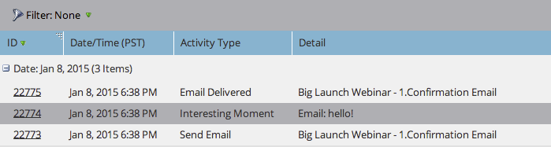

# 使用關鍵時刻 {#using-interesting-moments}

有趣的時刻是透過[!DNL Marketo Sales Insight]應用程式與您的銷售團隊通訊的關鍵。

>[!AVAILABILITY]
>
>這些僅供[!DNL Marketo Sales Insight]和[[!DNL Marketo Sales Connect]](/help/marketo/product-docs/marketo-sales-connect/marketo/interesting-moments-in-sales-connect.md)客戶使用。

## 什麼是有趣的時刻？ {#what-is-an-interesting-moment}

由您決定！ 您可以決定哪些資訊與您的銷售團隊相關。 您的銷售團隊可能想知道潛在客戶何時會：

* 瀏覽您網站上的定價頁面
* 按一下新產品公告電子郵件中的連結
* 要求產品示範

## 我該如何打造有趣的時刻？  {#how-do-i-create-an-interesting-moment}

1. 選擇一個[智慧型行銷活動](/help/marketo/product-docs/core-marketo-concepts/smart-campaigns/understanding-smart-campaigns.md)，最好是您的銷售團隊在觸發時感興趣的行銷活動。

   

1. 拖曳至&#x200B;**[!UICONTROL Interesting Moments]**&#x200B;流程步驟上。

   

1. 選取&#x200B;**型別** （[!UICONTROL Email]、[!UICONTROL Milestone]或[!UICONTROL Web]）。

   

1. 在&#x200B;**[!UICONTROL Description]**&#x200B;欄位中寫入訊息給您的銷售團隊，說明此動作重要的原因。

   

   >[!NOTE]
   >
   >Marketo也會新增發生日期以及新增有趣時刻的方式(即潛在客戶動作>流程步驟、SOAP API)。

## 這怎麼會更有趣呢？  {#how-can-this-get-even-more-interesting}

Token！ 在說明欄位中新增這些聯絡人，可為您的銷售團隊提供更具體的資訊，例如已開啟潛在客戶之電子郵件的主旨行或傳送者。 檢視哪些權杖可在[有趣時刻的權杖](/help/marketo/product-docs/marketo-sales-insight/msi-for-salesforce/features/tabs-in-the-msi-panel/interesting-moments/trigger-tokens-for-interesting-moments.md)字彙表中使用。

>[!TIP]
>
>從五個有趣的時刻開始，然後與您的銷售團隊合作，決定他們想檢視哪些資訊。

## Marketo中有趣的時刻是什麼樣子？  {#what-does-an-interesting-moment-look-like-in-marketo}

將在[潛在客戶的活動記錄](/help/marketo/product-docs/core-marketo-concepts/smart-lists-and-static-lists/managing-people-in-smart-lists/using-the-person-detail-page.md)中顯示有趣的時刻。

## [!DNL Salesforce]中某個有趣的時刻是什麼樣子？  {#what-does-an-interesting-moment-look-like-in-salesforce}

在您[安裝 [!DNL Marketo Sales Insight] 應用程式](/help/marketo/product-docs/marketo-sales-insight/msi-for-salesforce/configuration/configure-marketo-sales-insight-in-salesforce-enterprise-unlimited.md)後，潛在客戶、連絡人、帳戶或商機頁面上將會顯示有趣的時刻。 它們也會出現在潛在客戶摘要、[!DNL Sales Insight]和觀看清單的[!DNL Best Bets]儀表板中。

## [!DNL Salesforce1]中某個有趣的時刻是什麼樣子？ {#what-does-an-interesting-moment-look-like-in-salesforce-1}

在您安裝或更新[!DNL Marketo Sales Insight]的[!DNL Salesforce1]後，潛在客戶的相關連結下方會顯示有趣的時刻。

## 訂閱有趣的時刻 {#subscribe-to-interesting-moments}

您可以在「有趣的時刻」標籤或「潛在客戶摘要」中按一下「[!UICONTROL Subscribe]」按鈕，以訂閱「有趣的時刻」。 這兩個專案的下列步驟相同。

1. 按一下訂閱圖示。 接著，系統會將您導覽至「電子郵件訂閱」標籤。

1. 您可以根據[!UICONTROL Name]、[!UICONTROL Account]、[!UICONTROL Type]或[!UICONTROL Description]選擇要接收的電子郵件警示型別。

1. 選擇您要傳送警示給（您自己/團隊成員）的電子郵件地址

1. 按一下「**[!UICONTROL Subscribe]**」。

>[!NOTE]
>
>訂閱有趣的時刻型別或說明時，使用者會在觸發符合該型別或說明的有趣時刻時，收到其所擁有之人員（潛在客戶/聯絡人）的電子郵件通知。

