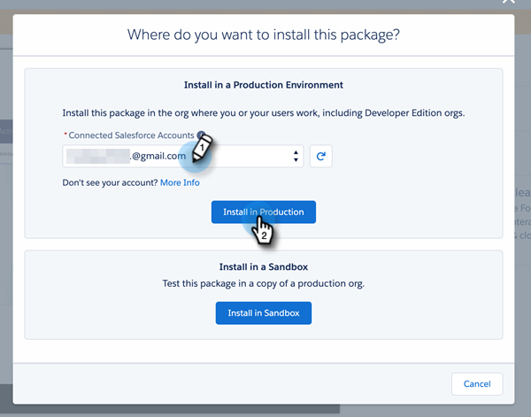

# 在Salesforce AppExchange {#install-marketo-sales-insight-package-in-salesforce-appexchange}中安裝Marketo Sales Insight套件

您必須先在Salesforce訂閱中安裝Marketo Sales Insight應用程式，才能享受Sales Insight提供的一切好處。 這是方法。

>[!NOTE]
>
>**需要管理員權限**

>[!NOTE]
>
>Marketo Sales Insight與Salesforce Platform(Shield)Encryption相容。

1. 前往Marketon Sales Insight的[AppExchange頁面，然後按一下&#x200B;**立即取得**。](https://appexchange.salesforce.com/listingDetail?listingId=a0N30000001SVZmEAO)

   

1. 按一下「**登入AppExchange**」按鈕，然後使用您的Salesforce憑證登入。

1. 輸入您所連線的Salesforce帳戶登入，然後按一下「在Production中安裝」。****

   

   >[!TIP]
   >
   >如果您想先在沙盒中測試它，請選擇&#x200B;**「安裝在沙盒中」**。

1. 閱讀並接受條款與條件，然後按一下「確認並安裝」。****

   

1. 您可以選擇「僅限管理員安裝」（稍後提供特定設定檔的MSI存取權）、「為所有使用者安裝」或「為特定設定檔安裝」。

   

1. 開始安裝程式後，您可能會看到以下消息。 安裝完成後，您將會收到電子郵件。 按一下&#x200B;**Done**&#x200B;關閉。

   

1. 驗證&#x200B;**Marketo Sales Insight**&#x200B;是否在已安裝的包中。

   

1. 按一下您姓名旁的&#x200B;**Setup**。

   

1. 搜索「對象」，然後按一下&#x200B;**Create**&#x200B;下的&#x200B;**Objects**。

   

1. 請再次檢查是否已檢查&#x200B;**Deployed**&#x200B;是否已檢查所有Marketo Sales Insight項目。

   

1. 如果未部署對象，請按一下項目旁的&#x200B;**編輯**。

   

1. 在「**部署狀態**」部分下，選擇「**部署**」，然後按一下「保存&#x200B;**」。**

   

幹得好！ 現在，您已安裝並部署Marketo Sales Insight。 繼續為您的銷售團隊進行設定，並觀看銷售飛漲。

>[!MORELIKETHIS]
>
>[在Salesforce Professional Edition中設定Marketo Sales Insight](/help/marketo/product-docs/marketo-sales-insight/msi-for-salesforce/configuration/configure-marketo-sales-insight-in-salesforce-professional-edition.md)
>
>[在Salesforce Enterprise中設定Marketo Sales Insight/Unlimited](/help/marketo/product-docs/marketo-sales-insight/msi-for-salesforce/configuration/configure-marketo-sales-insight-in-salesforce-enterprise-unlimited.md)
