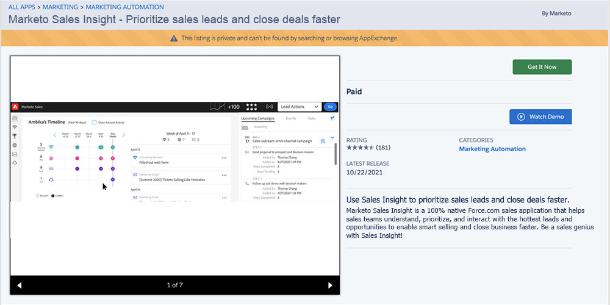
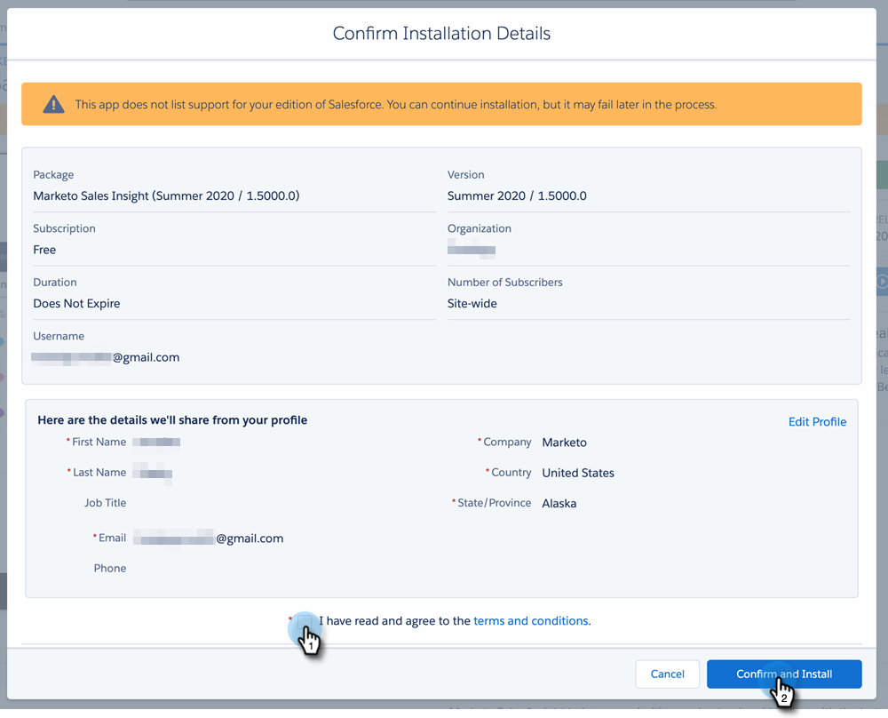
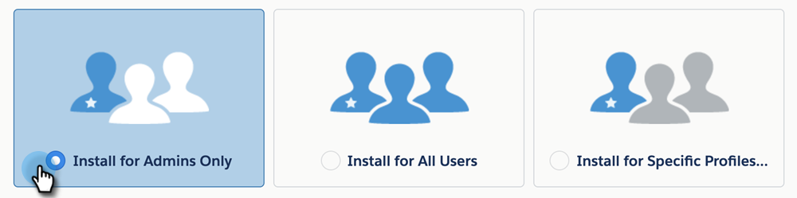
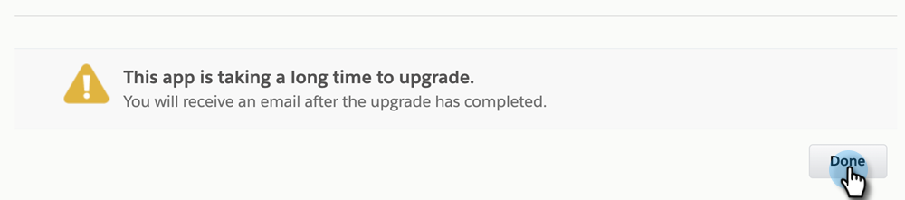
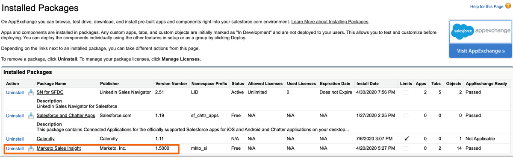
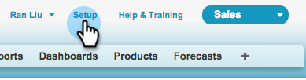
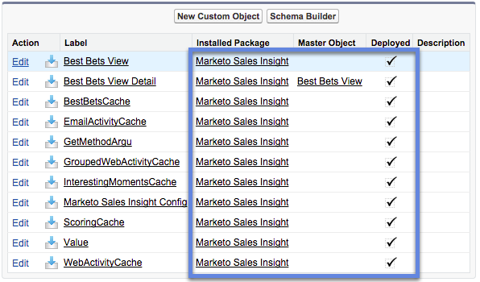
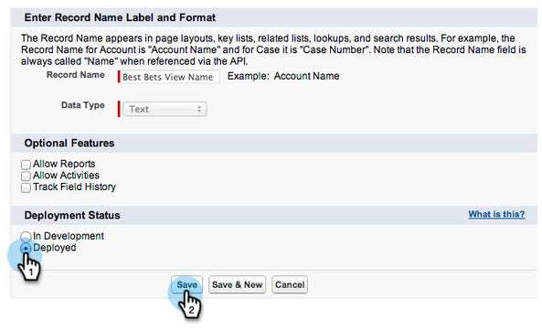

# 在[!DNL Salesforce] AppExchange中安裝[!DNL Marketo Sales Insight]套件 {#install-marketo-sales-insight-package-in-salesforce-appexchange}

您必須先在您的[!DNL Salesforce]訂閱中安裝[!DNL Marketo Sales Insight]應用程式，才能享受[!DNL Sales Insight]提供的所有優點。 方法如下。

>[!NOTE]
>
>**需要管理員權限**

>[!NOTE]
>
>[!DNL Marketo Sales Insight]與[!DNL Salesforce] Platform (Shield)加密相容。

1. 移至 [!DNL Marketo Sales Insight][&#128279;](https://appexchange.salesforce.com/listingDetail?listingId=a0N30000001SVZmEAO)的AppExchange頁面，然後按一下&#x200B;**[!UICONTROL Get it Now]**。

   

1. 按一下「**[!UICONTROL Log in to the AppExchange]**」按鈕，並使用您的[!DNL Salesforce]認證登入。

1. 輸入連線的[!DNL Salesforce]帳戶登入，然後按一下&#x200B;**[!UICONTROL Install in Production]**。

   

   >[!TIP]
   >
   >如果您想先在沙箱中測試它，請選擇&#x200B;**[!UICONTROL Install in Sandbox]**。

1. 閱讀並接受條款及條件，然後按一下&#x200B;**[!UICONTROL Confirm and Install]**。

   

1. 您可以選擇&quot;[!UICONTROL Install for Admins Only]&quot; （並稍後提供MSI存取特定設定檔）、&quot;[!UICONTROL Install for All Users]&quot;或&quot;[!UICONTROL Install for Specific Profiles]&quot;。

   

1. 開始安裝程式後，您可能會看到下列訊息。 安裝完成後，您將會收到電子郵件。 按一下&#x200B;**完成**&#x200B;以關閉。

   

1. 驗證&#x200B;**[!UICONTROL Marketo Sales Insight]**&#x200B;是否在已安裝的套件中。

   

1. 按一下您名稱旁的&#x200B;**[!UICONTROL Setup]**。

   

1. 搜尋&quot;[!UICONTROL objects]&quot;，然後按一下&#x200B;**[!UICONTROL Create]**&#x200B;下方的&#x200B;**[!UICONTROL Objects]**。

   

1. 仔細檢查是否已針對所有[!DNL Marketo Sales Insight]個專案檢查&#x200B;**[!UICONTROL Deployed]**。

   

1. 如果未部署物件，請按一下專案旁的&#x200B;**[!UICONTROL Edit]**。

   

1. 在&#x200B;**[!UICONTROL Deployment Status]**&#x200B;區段下，選取&#x200B;**[!UICONTROL Deployed]**&#x200B;並按一下&#x200B;**[!UICONTROL Save]**。

   

做得好！ 現在您已安裝並部署[!DNL Marketo Sales Insight]。 繼續為您的銷售團隊進行設定，並觀看銷售飆升過程。

>[!MORELIKETHIS]
>
>* [在 [!DNL Salesforce] Professional Edition](/help/marketo/product-docs/marketo-sales-insight/msi-for-salesforce/configuration/configure-marketo-sales-insight-in-salesforce-professional-edition.md)設定 [!DNL Marketo Sales Insight] 
>* [在 [!DNL Salesforce] Enterprise/Unlimited](/help/marketo/product-docs/marketo-sales-insight/msi-for-salesforce/configuration/configure-marketo-sales-insight-in-salesforce-enterprise-unlimited.md)中設定 [!DNL Marketo Sales Insight] 
>* [將銷售Insight存取權新增至設定檔](/help/marketo/product-docs/marketo-sales-insight/msi-for-salesforce/configuration/add-sales-insight-access-to-profiles.md){target="_blank"}
