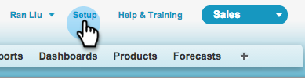

# 在SalesforceAppExchange中安裝Marketo Sales Insight套件 {#install-marketo-sales-insight-package-in-salesforce-appexchange}

您必須先在Salesforce訂閱中安裝Marketo Sales Insight應用程式，才能享受Sales Insight提供的所有優點。 這是方法。

>[!NOTE]
>
>**需要管理權限**

>[!NOTE]
>
>Marketo Sales Insight與Salesforce Platform(Shield)加密相容。

1. 前往 [Marketo Sales Insight的AppExchange頁面](https://appexchange.salesforce.com/listingDetail?listingId=a0N30000001SVZmEAO) 按一下 **立即獲取**.

   

1. 按一下 **登入AppExchange** 按鈕並使用您的Salesforce憑證登入。

1. 輸入已連接的Salesforce帳戶登錄名，然後按一下 **在生產環境中安裝**.

   

   >[!TIP]
   >
   >如果您想先在沙箱中測試，請選擇 **在沙箱中安裝**.

1. 閱讀並接受條款與條件，然後按一下 **確認和安裝**.

   

1. 您可以選擇「僅為管理員安裝」（稍後提供對特定配置檔案的MSI訪問）、「為所有用戶安裝」或「為特定配置檔案安裝」。

   

1. 開始安裝程式後，您可能會看到下列訊息。 安裝完成後，您會收到電子郵件。 按一下 **完成** 不能解雇。

   

1. 確認 **Marketo Sales Insight** 位於已安裝的軟體包中。

   

1. 按一下 **設定** 在你的名字旁邊。

   

1. 搜尋「物件」，然後按一下 **物件** 在 **建立**.

   

1. 仔細檢查 **已部署** 會檢查所有Marketo Sales Insight項目。

   

1. 如果未部署對象，請按一下 **編輯** 在項目旁邊。

   

1. 在 **部署狀態** 部分，選擇 **已部署**，然後按一下 **儲存**.

   

幹得好！ 現在您已安裝並部署了Marketo Sales Insight。 請為您的銷售團隊配置它，並觀看銷售飛天車。

>[!MORELIKETHIS]
>
>* [在Salesforce Professional Edition中設定Marketo Sales Insight](/help/marketo/product-docs/marketo-sales-insight/msi-for-salesforce/configuration/configure-marketo-sales-insight-in-salesforce-professional-edition.md)
>* [在Salesforce Enterprise/Unlimited中設定Marketo Sales Insight](/help/marketo/product-docs/marketo-sales-insight/msi-for-salesforce/configuration/configure-marketo-sales-insight-in-salesforce-enterprise-unlimited.md)
>* [將Sales Insight存取權新增至設定檔](/help/marketo/product-docs/marketo-sales-insight/msi-for-salesforce/configuration/add-sales-insight-access-to-profiles.md){target=&quot;_blank&quot;}

