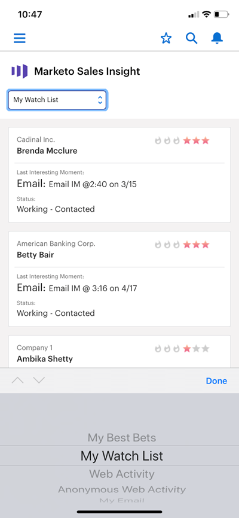

# Salesforce1 {#best-bets-in-salesforce}中的最佳選擇

您的[最佳下注](/help/marketo/product-docs/marketo-sales-insight/msi-for-salesforce/features/stars-and-flames/priority-urgency-relative-score-and-best-bets.md)是您具有最高緊急度和相對分數的潛在客戶和聯繫人。 只有您擁有的銷售機會會顯示在該清單中，且清單會隨著銷售機會分數的變更而更新。

1. 前往Salesforce應用程式中的Marketo區域。

   在下拉式清單中，您可以選擇「我的最佳賭注」、「我的關注清單」、「Web活動」、「匿名Web活動」或「我的電子郵件」。

   

>[!MORELIKETHIS]
>
>* [Salesforce中的有趣時刻1](/help/marketo/product-docs/marketo-sales-insight/msi-for-salesforce/msi-for-mobile/interesting-moments-in-salesforce1.md)
>* [在Salesforce中傳送Marketon至電子郵件和促銷活動與監看清單動作1](/help/marketo/product-docs/marketo-sales-insight/msi-for-salesforce/msi-for-mobile/send-marketo-email-and-campaign-and-watchlist-actions-in-salesforce1.md)

