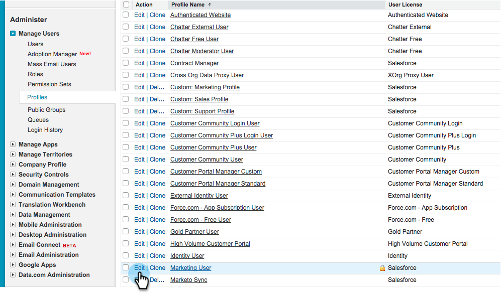
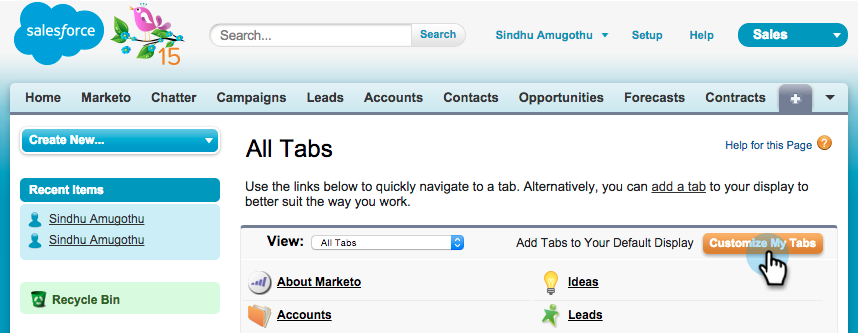

# 在Salesforce1中安裝和設定Marketo Sales Insight {#install-and-configure-marketo-sales-insight-in-salesforce}

>[!NOTE]
>
>現有客戶，請 [升級您的MSI封裝](/help/marketo/product-docs/marketo-sales-insight/msi-for-salesforce/upgrading/upgrading-your-msi-package.md) 再繼續！

>[!PREREQUISITES]
>
>如果您有Salesforce Enterprise/Unlimited：
>
>* [步驟3之1：將Marketo欄位新增至Salesforce (Enterprise/Unlimited)](/help/marketo/product-docs/crm-sync/salesforce-sync/setup/enterprise-unlimited-edition/step-1-of-3-add-marketo-fields-to-salesforce-enterprise-unlimited.md)
>* [步驟2之3：建立Marketo的Salesforce使用者(Enterprise/Unlimited)](/help/marketo/product-docs/crm-sync/salesforce-sync/setup/enterprise-unlimited-edition/step-2-of-3-create-a-salesforce-user-for-marketo-enterprise-unlimited.md)
>* [步驟3之3：連線Marketo與Salesforce (Enterprise/Unlimited)](/help/marketo/product-docs/crm-sync/salesforce-sync/setup/enterprise-unlimited-edition/step-3-of-3-connect-marketo-and-salesforce-enterprise-unlimited.md)
>* [在Salesforce Enterprise/Unlimited中設定Marketo Sales Insight](/help/marketo/product-docs/marketo-sales-insight/msi-for-salesforce/configuration/configure-marketo-sales-insight-in-salesforce-enterprise-unlimited.md)
>
>如果您有Salesforce Professional：
>
>* [在Salesforce Professional Edition中設定Marketo Sales Insight](/help/marketo/product-docs/marketo-sales-insight/msi-for-salesforce/configuration/configure-marketo-sales-insight-in-salesforce-professional-edition.md)
>

>[!NOTE]
>
>Salesforce1中的Marketo Sales Insight包括：首選、銷售機會摘要、有趣的時刻，以及「新增至Marketo促銷活動」。

## 啟用Salesforce1行動應用程式 {#enable-the-salesforce1-mobile-app}

1. 按一下 **設定** 然後 **行動管理**.

   

1. 按一下 **Salesforce1**.

   

1. 按一下 **Salesforce1設定**.

   

1. 按一下 **啟用Salesforce1行動瀏覽器應用程式**.

   

1. 按一下 **儲存**.

   

1. 選取 **行動管理**.

   

1. 按一下 **管理行動導覽功能表**.

   

1. 選取 **Marketo** 和 **新增** 它對應至 **已選取** 功能表專案。

   

1. 選取 **Marketo**，移動它 **上** 至所需區域，然後按一下 **儲存**.

   

## 隱藏過時的Marketo自訂物件 {#hide-outdated-marketo-custom-object}

1. 按一下 **設定**.

   

1. 選取 **管理使用者**.

   

1. 選取 **設定檔**.

   

1. 按一下以 **編輯** 任何需要的設定檔。

   

1. 在 **索引標籤設定**，選取 _第一_ **Marketo**.

   

1. 選取 **標籤已隱藏**.

   

   >[!NOTE]
   >
   >請務必隱藏所有所需設定檔的Marketo標籤！

## 自訂標籤 {#customize-tabs}

1. 按一下 **+**.

   

1. 按一下 **自訂我的標籤**.

   

1. 選取 **Marketo** 和 **新增** 它會顯示在「選取的標籤」中。

   

1. 選取 **Marketo**，移動它 **上** 至所需區域，然後按一下 **儲存**.

   

## 自訂頁面配置 {#customize-page-layouts}

1. 按一下 **設定**.

   

1. 按一下 **設定**，型別 **頁面配置**，然後按一下 **頁面配置** 在潛在客戶底下。

   >[!NOTE]
   >
   >對貴組織使用的每個「頁面配置」（行銷、銷售等）重複步驟 連絡人、帳戶和機會物件。

   

1. 按一下 **編輯** 以變更銷售機會配置。

   

1. 按一下 **Visualforce頁面** 然後拖曳 **潛在客戶行動** 移至行動卡區段。

   

1. 將高度變更為66並按一下 **確定**.

   

1. 按一下 **欄位** 並拖曳 **新增至Marketo Campaign** 至 **Marketo Sales Insight** 區段。

   

   >[!TIP]
   >
   >在快速尋找中輸入「新增至」，以方便尋找新增至Marketo Campaign。

1. 按一下 **儲存**.

   

噢！ 您終於可以安裝Marketo Sales Insight for Salesforce1了！ 繼續操作，輕輕拍一下自己的後背。

>[!MORELIKETHIS]
>
>* [Salesforce1中的首選](/help/marketo/product-docs/marketo-sales-insight/msi-for-salesforce/msi-for-mobile/best-bets-in-salesforce1.md)
>* [Salesforce1中的有趣時刻](/help/marketo/product-docs/marketo-sales-insight/msi-for-salesforce/msi-for-mobile/interesting-moments-in-salesforce1.md)
>* [在Salesforce1中傳送Marketo電子郵件和Campaign及監看清單動作](/help/marketo/product-docs/marketo-sales-insight/msi-for-salesforce/msi-for-mobile/send-marketo-email-and-campaign-and-watchlist-actions-in-salesforce1.md)
