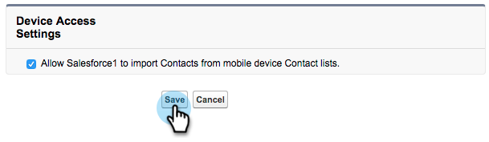

# 在[!DNL Marketo Sales Insight]中安裝並設定[!DNL Salesforce1] {#install-and-configure-marketo-sales-insight-in-salesforce}

>[!NOTE]
>
>現有客戶，請[升級您的MSI封裝](/help/marketo/product-docs/marketo-sales-insight/msi-for-salesforce/upgrading/upgrading-your-msi-package.md)，然後再繼續！

>[!PREREQUISITES]
>
>如果您有Salesforce Enterprise/Unlimited：
>
>* [步驟3之1：將Marketo欄位新增至 [!DNL Salesforce]  (Enterprise/Unlimited)](/help/marketo/product-docs/crm-sync/salesforce-sync/setup/enterprise-unlimited-edition/step-1-of-3-add-marketo-fields-to-salesforce-enterprise-unlimited.md)
>* [步驟2之3：建立Marketo (Enterprise/Unlimited)的 [!DNL Salesforce] 使用者](/help/marketo/product-docs/crm-sync/salesforce-sync/setup/enterprise-unlimited-edition/step-2-of-3-create-a-salesforce-user-for-marketo-enterprise-unlimited.md)
>* [步驟3之3：連線Marketo和 [!DNL Salesforce] (Enterprise/Unlimited)](/help/marketo/product-docs/crm-sync/salesforce-sync/setup/enterprise-unlimited-edition/step-3-of-3-connect-marketo-and-salesforce-enterprise-unlimited.md)
>* [在 [!DNL Marketo Sales Insight] Enterprise/Unlimited [!DNL Salesforce] 中設定](/help/marketo/product-docs/marketo-sales-insight/msi-for-salesforce/configuration/configure-marketo-sales-insight-in-salesforce-enterprise-unlimited.md)
>
>如果您有Salesforce Professional：
>
>* [在Marketo Professional Edition中設定Salesforce Sales Insight](/help/marketo/product-docs/marketo-sales-insight/msi-for-salesforce/configuration/configure-marketo-sales-insight-in-salesforce-professional-edition.md)
>

>[!NOTE]
>
>[!DNL Marketo Sales Insight]中的[!DNL Salesforce1]包括：[!DNLB最佳賭注]、銷售機會摘要、有趣的時刻，以及新增至Marketo行銷活動。

## 啟用[!DNL Salesforce1]行動應用程式 {#enable-the-salesforce1-mobile-app}

1. 按一下&#x200B;**[!DNL Setup]**，然後再按&#x200B;**[!DNL Mobile Administration]**。

   

1. 按一下「**[!UICONTROL Salesforce1]**」。

   

1. 按一下「**[!UICONTROL Salesforce1 Settings]**」。

   

1. 按一下「**[!UICONTROL Enable the Salesforce1 mobile browser app]**」。

   

1. 按一下「**[!UICONTROL Save]**」。

   

1. 選擇「**[!UICONTROL Mobile Administration]**」。

   

1. 按一下「**[!UICONTROL Manage the mobile navigation menu]**」。

   

1. 選取&#x200B;**[!UICONTROL Marketo]**&#x200B;並將其&#x200B;**[!UICONTROL Add]**&#x200B;至&#x200B;**[!UICONTROL Selected]**&#x200B;功能表專案。

   

1. 選取&#x200B;**[!UICONTROL Marketo]**，將其&#x200B;**[!UICONTROL Up]**&#x200B;移至所需區域，然後按一下&#x200B;**[!UICONTROL Save]**。

   

## 隱藏過時的Marketo自訂物件 {#hide-outdated-marketo-custom-object}

1. 按一下「**[!UICONTROL Setup]**」。

   

1. 選擇「**[!UICONTROL Manage Users]**」。

   

1. 選擇「**[!UICONTROL Profiles]**」。

   

1. 按一下以&#x200B;**[!UICONTROL Edit]**&#x200B;任何需要的設定檔。

   

1. 在&#x200B;**[!UICONTROL Tab Settings]**&#x200B;底下，選取&#x200B;_第一個_ **[!UICONTROL Marketo]**。

   

1. 選擇「**[!UICONTROL Tab Hidden]**」。

   

   >[!NOTE]
   >
   >請務必隱藏所有所需設定檔的Marketo標籤！

## 自訂標籤 {#customize-tabs}

1. 按一下&#x200B;**+**。

   

1. 按一下「**[!UICONTROL Customize My Tabs]**」。

   

1. 選取&#x200B;**[!UICONTROL Marketo]**&#x200B;並將其&#x200B;**[!UICONTROL Add]**&#x200B;至選取的索引標籤。

   

1. 選取&#x200B;**[!UICONTROL Marketo]**，將其&#x200B;**[!UICONTROL Up]**&#x200B;移至所需區域，然後按一下&#x200B;**[!UICONTROL Save]**。

   

## 自訂頁面配置 {#customize-page-layouts}

1. 按一下「**[!UICONTROL Setup]**」。

   

1. 按一下&#x200B;**[!UICONTROL Setup]**，輸入&#x200B;**[!UICONTROL Page Layouts]**，然後按一下[潛在客戶]底下的&#x200B;**[!UICONTROL Page Layouts]**。

   >[!NOTE]
   >
   >對貴組織用於Contact、Account和Opportunity物件的每個「頁面配置」（行銷、銷售等）重複這些步驟。

   

1. 按一下&#x200B;**[!UICONTROL Edit]**&#x200B;以變更銷售機會配置。

   

1. 按一下「**[!UICONTROL Visualforce Pages]**」，然後將「**[!UICONTROL Lead Mobile]**」拖曳到「行動卡片」區段。

   

1. 將高度變更為66並按一下&#x200B;**[!UICONTROL OK]**。

   

1. 按一下&#x200B;**[!UICONTROL Fields]**&#x200B;並將&#x200B;**[!UICONTROL Add to Marketo Campaign]**&#x200B;拖曳至&#x200B;**[!UICONTROL Marketo Sales Insight]**&#x200B;區段。

   

   >[!TIP]
   >
   >在快速尋找中輸入「新增至」，以方便尋找新增至Marketo Campaign。

1. 按一下「**[!UICONTROL Save]**」。

   

噢！ 您終於完成了[!DNL Marketo Sales Insight]的[!DNL Salesforce1]安裝！ 繼續操作，輕輕拍一下自己的後背。

>[!MORELIKETHIS]
>
>* [[!DNL Best Bets] 在 [!DNL Salesforce1]](/help/marketo/product-docs/marketo-sales-insight/msi-for-salesforce/msi-for-mobile/best-bets-in-salesforce1.md)
>* [中的 [!DNL Salesforce1]](/help/marketo/product-docs/marketo-sales-insight/msi-for-salesforce/msi-for-mobile/interesting-moments-in-salesforce1.md)個有趣時刻
>* [在 [!DNL Salesforce1]](/help/marketo/product-docs/marketo-sales-insight/msi-for-salesforce/msi-for-mobile/send-marketo-email-and-campaign-and-watchlist-actions-in-salesforce1.md)中傳送Marketo電子郵件和行銷活動及監看清單動作
