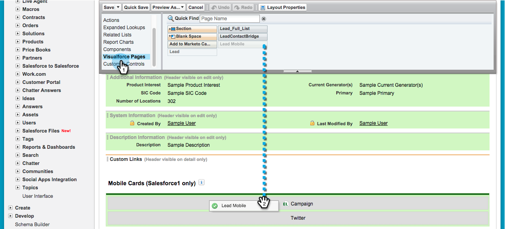

# 在Salesforce中安裝及設定Marketo Sales Insight1 {#install-and-configure-marketo-sales-insight-in-salesforce}

>[!NOTE]
>
>**提醒**
>
>現有客戶，請先 [升級您的MSI套件](http://docs.marketo.com/x/_gU6Ag) ，再繼續！

>[!NOTE]
>
>**必要條件**
>
>如果您有Salesforce Enterprise/Unlimited:
>
>* [步驟1（共3步）:將行銷人員欄位新增至Salesforce（企業版／無限製版）](../../../../product-docs/crm-sync/salesforce-sync/setup/enterprise-unlimited-edition/step-1-of-3-add-marketo-fields-to-salesforce-enterprise-unlimited.md)
>* [步驟2（共3步）:建立適用於行銷人員的Salesforce使用者（企業版／不限數量）](../../../../product-docs/crm-sync/salesforce-sync/setup/enterprise-unlimited-edition/step-2-of-3-create-a-salesforce-user-for-marketo-enterprise-unlimited.md)
>* [步驟3（共3步）:將行銷人員連線至Salesforce（企業版／無限製版）](../../../../product-docs/crm-sync/salesforce-sync/setup/enterprise-unlimited-edition/step-3-of-3-connect-marketo-and-salesforce-enterprise-unlimited.md)
>* [在Salesforce Enterprise中設定Marketo Sales Insight/Unlimited](../../../../product-docs/marketo-sales-insight/msi-for-salesforce/configuration/configure-marketo-sales-insight-in-salesforce-enterprise-unlimited.md)

>
>
如果您有Salesforce Professional:
>
>* [在Salesforce Professional Edition中設定Marketo Sales Insight](../../../../product-docs/marketo-sales-insight/msi-for-salesforce/configuration/configure-marketo-sales-insight-in-salesforce-professional-edition.md)

>

>[!NOTE]
>
>Salesforce1中的Marketo Sales Insight包括：最佳押注、潛在客戶宣傳、有趣時刻，以及新增至行銷活動。

1. 啟用Salesforce1行動應用程式
1. 按一 **下「設定** 」，然 **後按一下「Mobile Administration」**。

   

1. 按一下 **Salesforce1**。

   

1. 按一下「 **Salesforce1設定」**。

   

1. 按一下「 **啟用Salesforce1行動瀏覽器應用程式」**。

   

1. 按一下 **儲存**。

   

1. 選擇「 **行動管理**」。

   

1. 按一下「 **管理行動導覽功能表」**。

   

1. 選取**Marketo **和**將**新增至**已選取**功能表項目。

   

1. 選取 **Marketo**，將它移至所需區域，然後按一下「儲 **存」**。

   

1. 隱藏過期的行銷工具自訂物件
1. 按一 **下設定**。

   

1. 選擇 **管理用戶**。

   

1. 選擇「 **配置檔案**」。

   

1. 按一下以**編輯**任何所需的描述檔。

   

1. 在「標 **簽設定**」下方，選 *取第***一個Marketto**。

   ** 

   **

1. 選擇「 **標籤隱藏**」。

   ** 

   **

   >[!NOTE]
   >
   >請確定隱藏所有所需描述檔的「行銷人員」索引標籤！

1. 自訂標籤
1. 按一下** +**。

   

1. 按一 **下「自訂我的標籤**」。

   

1. 選取 **Marketto** 和**將它新增至選取的標籤。

   

1. 選取 **Marketo**，將它移至所需區域，然後按一下「儲 **存」**。

   

1. 自訂頁面版面
1. 按一 **下設定**。

   

1. 按一 **下「設定**」，輸入「 **頁面版面」**，然後按一下「銷售線 **索」下方的「頁面版面** 」。

   >[!NOTE]
   >
   >針對您的組織使用的每個頁面配置（行銷、銷售等）重複這些步驟 Contact 、 Account和Opportunity對象。

   

1. 按一 **下「編輯** 」以變更銷售線索配置。

   

1. 按一下「**Visualforce頁面」 **，然後拖曳** 「Lead Mobile **」至「行動卡」區段。

   

1. 將「Height（高度）」更改為66 ，然後按一下「 **OK（確定）**」。

   

1. 按一 **下「欄位** 」並拖曳**Add to Marketo Campaign至 **** Marketo Sales Insight **區段。

   

   >[!TIP]
   >
   >在「快速尋找」中輸入「新增至」，讓「新增至行銷人員促銷活動」更容易找到。

1. 按一下 **儲存**。

   

餵！ 您終於可以安裝適用於Salesforce1的Marketo Sales Insight了！ 去吧，給自己拍拍背。

>[!NOTE]
>
>**相關文章**
>
>* [Salesforce中的最佳選擇1](best-bets-in-salesforce1.md)
>* [Salesforce中的有趣時刻1](interesting-moments-in-salesforce1.md)
>* [在Salesforce中傳送Marketon至電子郵件和促銷活動與監看清單動作1](send-marketo-email-and-campaign-and-watchlist-actions-in-salesforce1.md)

>

