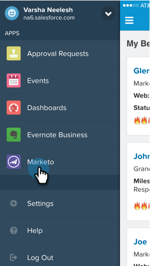

# 在Salesforce1中檢視銷售機會摘要 {#seeing-lead-feed-in-salesforce}

潛在客戶摘要是潛在客戶所進行有趣事件的最新清單。

1. 前往 **Marketo** 區域（在Salesforce1中）。

   

1. 點選向下箭頭。

   

1. 點選 **潛在客戶摘要**.

   

   完美！ 現在您知道如何取得銷售機會摘要了！

   

>[!MORELIKETHIS]
>
>* [Salesforce1中的有趣時刻](/help/marketo/product-docs/marketo-sales-insight/msi-for-salesforce/msi-for-mobile/interesting-moments-in-salesforce1.md)
>* [在Salesforce1中傳送Marketo電子郵件和Campaign及監看清單動作](/help/marketo/product-docs/marketo-sales-insight/msi-for-salesforce/msi-for-mobile/send-marketo-email-and-campaign-and-watchlist-actions-in-salesforce1.md)
>* [Salesforce1的最佳選擇](/help/marketo/product-docs/marketo-sales-insight/msi-for-salesforce/msi-for-mobile/best-bets-in-salesforce1.md)
