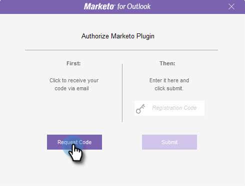

# 授權Marketo Outlook外掛程式 {#authorize-the-marketo-outlook-plugin}

要在Outlook中使用Marketo MSI插件，需要授權它。

>[!PREREQUISITES]
>
>您必須已安裝此外掛程式，且您必須獲得Marketo管理員的授權，才能以外掛程式使用者身分使用。

1. 按一下任一Marketo訊息按鈕。

   

1. 出現「授權Marketo外掛程式」對話方塊時，按一下 **要求代碼**.

   

1. 此代碼將發送到您的預設Outlook帳戶電子郵件地址。

   

1. 如果您的預設Outlook帳戶電子郵件地址簽出，您將收到註冊密鑰。 在快顯視窗中輸入，然後按一下 **提交**.

   

   >[!NOTE]
   >
   >註冊代碼 **14天後過期。**

1. 如果電子郵件地址未獲授權，您會收到這封不太開心的電子郵件。 請連絡您的Marketo管理員以解決問題。

   
