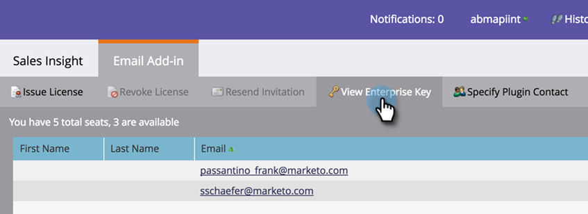

# 使用企業密鑰安裝Marketo Outlook載入項 {#install-the-marketo-add-in-for-outlook-with-an-enterprise-key}

許多時候，銷售代表的筆記型電腦沒有管理權限，他們的IT團隊負責遠程安裝所有軟體。 您可以使用企業密鑰以此方式安裝Outlook的Marketo Add-in for Outlook，該密鑰位於「管理員」的「銷售分析」部分。

>[!PREREQUISITES]
>
>管理員必須 [核發Marketo電子郵件增益集授權](/help/marketo/product-docs/marketo-sales-insight/msi-outlook-plugin/issue-a-marketo-email-add-in-license.md).

>[!NOTE]
>
>如果您沒有看到「查看企業密鑰」按鈕，請聯繫 [Marketo支援](https://nation.marketo.com/t5/Support/ct-p/Support) 來啟用。

1. 在「我的Marketo」中，按一下 **管理** 然後 **Sales Insight**.

   

1. 按一下 **電子郵件載入項** 標籤。

   

1. 按一下 **查看企業密鑰**.

   

1. 複製Outlook企業許可密鑰並將其貼到電子郵件中，以及 [此連結](/help/marketo/product-docs/marketo-sales-insight/msi-outlook-plugin/marketo-outlook-plugin-installation-by-it.md)，然後將其發送到您的IT部門進行遠程安裝。

   

   僅此而已！ 接下來，銷售代表將 [註冊過程](/help/marketo/product-docs/marketo-sales-insight/msi-outlook-plugin/authorize-the-marketo-outlook-plugin.md).
