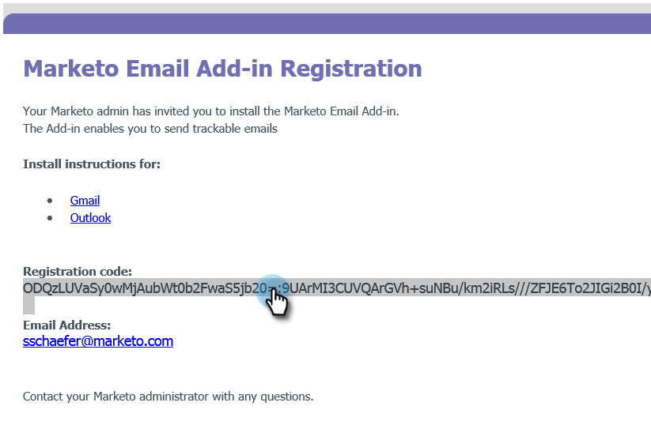
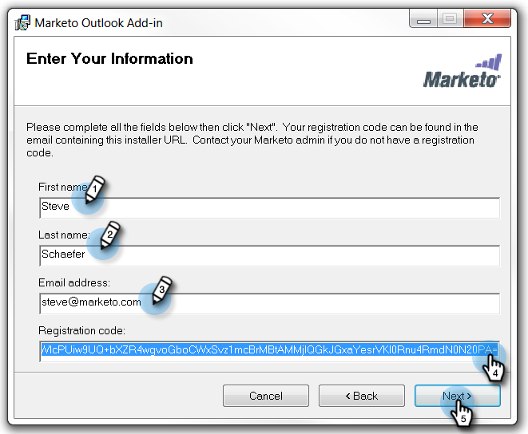
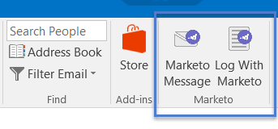

# 使用註冊代碼安裝適用於Outlook的Marketo電子郵件增益集 {#install-the-marketo-email-add-in-for-outlook-with-a-registration-code}

如果使用者可以存取其筆記型電腦上的管理員設定，您可以直接將註冊代碼傳送給他們。

如果您尚未收到邀請電子郵件，請要求Marketo管理員邀請您。

>[!PREREQUISITES]
>
>您必須是 [已核發Marketo電子郵件增益集授權](/help/marketo/product-docs/marketo-sales-insight/msi-outlook-plugin/issue-a-marketo-email-add-in-license.md).

>[!IMPORTANT]
>
>Windows使用者資料夾包含非英文字元的電腦不支援安裝。 此資料夾由Windows自動產生，位於 `<System Root>\Users\` 根據Windows使用者名稱，如果Windows使用者名稱是非英文名稱，則可能包含非英文字元。 請與您的IT團隊合作，確認您是否遇到安裝問題。

>[!NOTE]
>
>Sales Insight Actions功能（包括「傳送銷售電子郵件」、「新增至銷售促銷活動」和「工作」）在Gmail和Outlook的Sales Insight電子郵件外掛程式中無法使用。 目前，使用者在使用Sales Insight電子郵件外掛程式時，只能從電子郵件使用者端傳送包含或不包含Marketo電子郵件範本的可追蹤電子郵件。

## 下載安裝程式 {#download-installer}

1. 識別您的 [Microsoft Outlook版本](https://support.office.com/en-us/article/what-version-of-outlook-do-i-have-b3a9568c-edb5-42b9-9825-d48d82b2257c){target="_blank"}

1. 按一下連結，即可下載適用於您Microsoft Outlook版本的安裝程式。

   >[!NOTE]
   >
   >目前，下列連結僅可在Microsoft Edge中運作，或在Chrome中按一下滑鼠右鍵。 造成任何不便，敬請見諒。

   | Outlook版本 | 32位元Outlook | 64位元Outlook |
   |---|---|---|
   | Outlook 2000 | 不支援 | 不適用 |
   | Outlook 2003 | [下載](https://munchkin.marketo.net/MarketoAddInSetup32.msi) | 不適用 |
   | Outlook 2007 | [下載](https://munchkin.marketo.net/MarketoAddInSetup32.msi) | 不適用 |
   | Outlook 2010 | [下載](https://munchkin.marketo.net/MarketoAddInSetup32.msi) | [下載](https://munchkin.marketo.net/MarketoAddInSetup64.msi) |
   | Outlook 2013 | [下載](https://munchkin.marketo.net/MarketoAddInSetup32.msi) | [下載](https://munchkin.marketo.net/MarketoAddInSetup64.msi) |
   | Outlook 2016 | [下載](https://munchkin.marketo.net/MarketoAddInSetup32.msi) | [下載](https://munchkin.marketo.net/MarketoAddInSetup64.msi) |
   | Outlook 2019 | [下載](https://munchkin.marketo.net/MarketoAddInSetup32.msi) | [下載](https://munchkin.marketo.net/MarketoAddInSetup64.msi) |
   | 適用於Mac的Outlook | 不支援 | 不支援 |
   | Outlook Web App | 不支援 | 不支援 |
   | Office 365* | [下載](https://munchkin.marketo.net/MarketoAddInSetup32.msi) | [下載](https://munchkin.marketo.net/MarketoAddInSetup64.msi) |

   *Office 365版本：僅限Windows使用者端（在Windows 10、Enterprise或Pro）。

## 複製您的註冊代碼 {#copy-your-registration-code}

1. 從您收到的邀請電子郵件複製註冊代碼。

   

1. 關閉Microsoft Outlook。

   

## 安裝 {#install}

1. 執行安裝程式。

   

   >[!NOTE]
   >
   >如果您收到安全性警告，請不要擔心！ 只需按一下 **執行**.

1. 按一下 **下一個**.

   

1. 填入 **名字**， **姓氏**， **電子郵件地址**，然後複製並貼上 **註冊代碼** 從電子郵件進入表單並按一下 **下一個**.

   

   >[!TIP]
   >
   >如果安裝失敗，請洽詢您的IT部門，以確保不會封鎖HTTPS流量。 安裝程式需要開啟HTTPS流量。

1. 按一下 **下一個** ，以安裝在預設位置。

   

1. 按一下 **下一個**.

   

   >[!NOTE]
   >
   >如果您收到有關未知發行者的安全性提示，請按一下 **是**.

1. 安裝現已完成，請按一下 **關閉**.

   

1. 現在開啟Microsoft Outlook並檢視Marketo按鈕。

   

   太棒了！ 現在Marketo按鈕的位置更好了。

進一步瞭解使用Marketo訊息和使用Marketo記錄動作。

>[!MORELIKETHIS]
>
>* [使用適用於Outlook的Marketo電子郵件增益集傳送及追蹤電子郵件](/help/marketo/product-docs/marketo-sales-insight/msi-outlook-plugin/send-and-track-an-email-with-the-email-add-in-for-outlook.md){target="_blank"}
>* [使用Marketo範本從Outlook傳送及追蹤](/help/marketo/product-docs/marketo-sales-insight/msi-outlook-plugin/send-and-track-from-outlook-using-a-marketo-template.md){target="_blank"}
