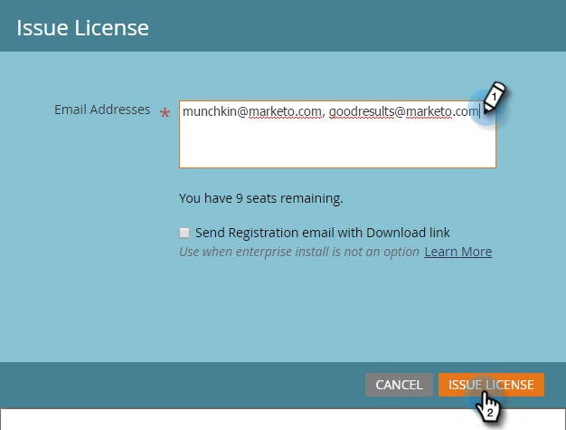

# 核發Marketo電子郵件增益集授權 {#issue-a-marketo-email-add-in-license}

任何人若想使用Marketo Email Outlook外接程式，必須先獲得授權。 提供授權的方式有兩種。

* **[企業密鑰安裝](/help/marketo/product-docs/marketo-sales-insight/msi-outlook-plugin/install-the-marketo-add-in-for-outlook-with-an-enterprise-key.md)**:當銷售代表沒有公司筆記型電腦的管理權限，並且無法安裝插件、軟體等時，可使用此方法。 上。 在此情況下，Marketo管理員會向授權使用者清單發放授權。 接下來，IT團隊使用企業密鑰將插件遠程部署到所有授權用戶的電腦。 外掛程式使用者接著會授權它。
* **[註冊代碼安裝](/help/marketo/product-docs/marketo-sales-insight/msi-outlook-plugin/install-the-marketo-email-add-in-for-outlook-with-a-registration-code.md)**:當銷售代表擁有公司筆記型電腦的管理權限並可安裝插件、軟體等時，可使用此方法。 上。 針對此程式，Marketo管理員會向授權使用者清單發放授權，並直接透過下載連結傳送註冊電子郵件給他們。 銷售代表會收到一封包含插件下載連結和唯一註冊URL的電子郵件。

>[!AVAILABILITY]
>
>並非所有客戶都購買過此功能。 如需詳細資訊，請連絡您的銷售代表。

>[!NOTE]
>
>**需要管理權限**

1. 在「我的Marketo」中，依序按一下「管理員」和「銷售分析」。

1. 在 **電子郵件增益集** 按一下 **發行授權**.

   

1. 輸入需要授權使用插件的銷售代表的電子郵件地址，然後按一下 **發行授權**.

   >

   >[!TIP]
   >
   >您可以輸入多個電子郵件地址，以逗號分隔。

   >[!NOTE]
   >
   >若要遠端安裝外掛程式，請取消勾選核取方塊，並將您的IT團隊傳送給 [企業密鑰](/help/marketo/product-docs/marketo-sales-insight/msi-outlook-plugin/install-the-marketo-add-in-for-outlook-with-an-enterprise-key.md).
   >
   >如果您的銷售代表擁有對其電腦的管理員訪問權限，請選中該框，然後您就完成了！

>[!MORELIKETHIS]
>
>* [使用企業密鑰安裝Marketo Outlook載入項](/help/marketo/product-docs/marketo-sales-insight/msi-outlook-plugin/install-the-marketo-add-in-for-outlook-with-an-enterprise-key.md)
>* [使用註冊代碼安裝Outlook的Marketo Email Add-in](/help/marketo/product-docs/marketo-sales-insight/msi-outlook-plugin/install-the-marketo-email-add-in-for-outlook-with-a-registration-code.md)
>* [升級Outlook的Marketo電子郵件增益集](/help/marketo/product-docs/marketo-sales-insight/msi-outlook-plugin/upgrade-your-marketo-email-add-in-for-outlook.md)

