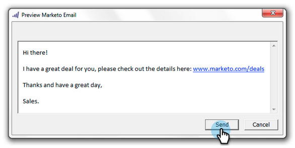

# 使用Outlook的電子郵件增益集來傳送及追蹤電子郵件 {#send-and-track-an-email-with-the-email-add-in-for-outlook}

您可以直接從Outlook透過Marketo傳送及追蹤電子郵件。

>[!PREREQUISITES]
>
>如果尚未安裝，請安裝 [Marketo for Outlook電子郵件增益集](/help/marketo/product-docs/marketo-sales-insight/msi-outlook-plugin/install-the-marketo-email-add-in-for-outlook-with-a-registration-code.md).

1. 開啟Microsoft Outlook並建立新電子郵件。

   

   >[!CAUTION]
   >
   >如果您在電子郵件中包含多個收件者，則所有活動都會在第一個收件者底下受到追蹤。

1. 按照正常方式撰寫電子郵件，然後按一下 **傳送及追蹤**.

   

   >[!NOTE]
   >
   >如果您傳送電子郵件給您Marketo例項中不存在的人，系統會自動為他們建立人員記錄。 他們的姓永遠是&#39;mktUnknown&#39;，這樣您就能輕鬆找到他們。

   >[!TIP]
   >
   >如果您想使用Marketo範本，請參閱 [使用模板從Outlook發送和跟蹤](/help/marketo/product-docs/marketo-sales-insight/msi-outlook-plugin/send-and-track-from-outlook-using-a-marketo-template.md).

1. 查看預覽，然後按一下 **傳送**.

   

   >[!CAUTION]
   >
   >反垃圾郵件技術通常會拒絕在發送電子郵件後20秒內開啟和點擊，因此，在測試時，請至少等待那麼長時間以開啟/點擊。

   若要查看誰收到了通過Outlook發送的電子郵件，請使用「已發送銷售電子郵件」篩選器建立智慧清單。

   

就這麼簡單！ 即使此電子郵件是由銷售人員的Outlook傳送，仍會在Marketo中追蹤。

>[!MORELIKETHIS]
>
>[在Marketo中記錄來自您銷售機會的傳入郵件](/help/marketo/product-docs/marketo-sales-insight/using-msi/log-inbound-mail-from-your-leads-in-marketo.md)
