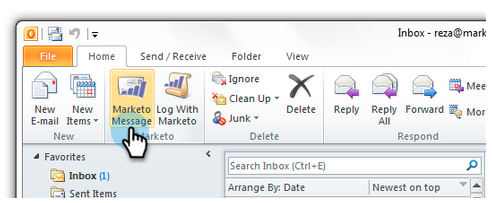
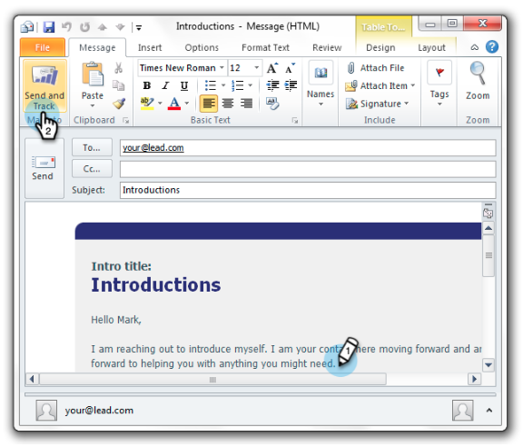

# 使用Marketo範本從Outlook傳送及追蹤 {#send-and-track-from-outlook-using-a-marketo-template}

如果您的行銷團隊已將範本提供給您使用，以下說明在撰寫電子郵件時，如何使用範本以節省時間。

1. 開啟Microsoft Outlook，然後按一下 **Marketo訊息**.

   

1. 選取您要的範本、預覽，然後按一下 **確定**.

   

1. 進行所有編輯，然後按一下 **傳送及追蹤**.

   

   >[!NOTE]
   >
   >附加元件不支援Token。 移除範本中可能包含的任何項目。

1. 查看預覽，確定看起來正常，然後按一下 **傳送**.

   

   就這樣！ 你可以省下很多時間，用你超棒的營銷團隊為你做的模板。

>[!MORELIKETHIS]
>
>[在Marketo中記錄來自您銷售機會的傳入郵件](/help/marketo/product-docs/marketo-sales-insight/using-msi/log-inbound-mail-from-your-leads-in-marketo.md)
