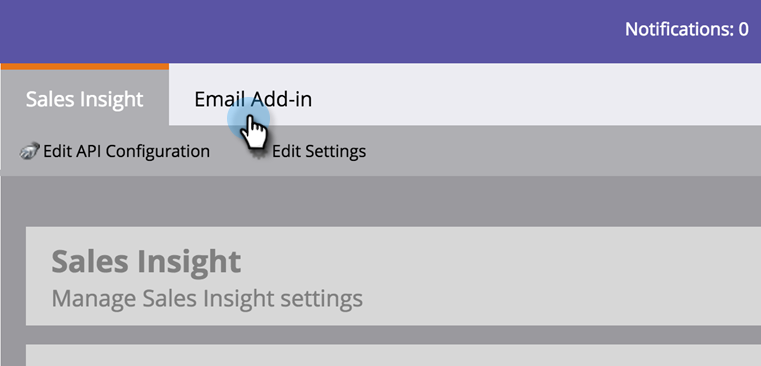

# 指定Marketo [!UICONTROL Sales Insight]外掛程式管理員 {#specify-marketo-sales-insight-plugin-admins}

當您邀請使用者在[!DNL Outlook]上設定MSI時，您可以指定哪些連絡人要出現在您傳送給使用者的電子郵件通知中。

1. 在「我的Marketo」中，按一下「**[!UICONTROL Admin]**」，然後按「**[!UICONTROL Sales Insight]**」。

   

1. 按一下「**[!UICONTROL Email Add-In]**」索引標籤。

   

1. 按一下「**[!UICONTROL Specify Plugin Contact]**」。

   

1. 按一下以指定外掛程式連絡人。

   

1. 按一下「**[!UICONTROL Save]**」。

   

1. 您選取的聯絡人將會列在授權程式期間銷售代表收到的電子郵件中。

   

   完美！
