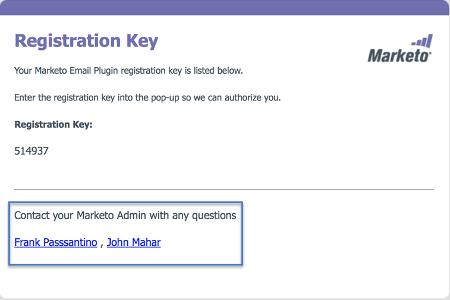

# 指定Marketo Sales Insight外掛程式管理員 {#specify-marketo-sales-insight-plugin-admins}

當邀請用戶在Outlook上設定MSI時，您可以指定要在發送給用戶的電子郵件通知中顯示哪些聯繫人。

1. 在「我的Marketo」中，按一下 **管理** 然後 **Sales Insight**.

   

1. 按一下 **電子郵件載入項** 標籤。

   

1. 按一下 **指定外掛程式連絡人**.

   

1. 按一下以指定外掛程式聯絡人。

   

1. 按一下 **儲存**.

   

1. 您選擇的聯繫人將列在授權過程中收到的電子郵件銷售代表中。

   

   完美！
