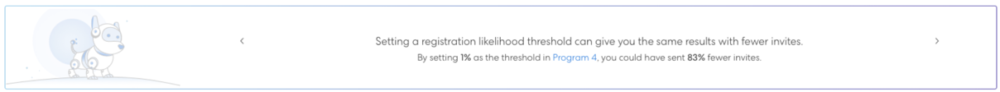

# 了解目標跟蹤和預計註冊 {#understanding-goal-tracking-and-projected-registrations}

之後 [設定事件目標](/help/marketo/product-docs/marketo-sky/setting-event-goals.md) 透過 [智慧型行銷活動](/help/marketo/product-docs/core-marketo-concepts/smart-campaigns/creating-a-smart-campaign/create-a-new-smart-campaign.md)，以下說明如何追蹤目標進度並了解Marketo的預測。

>[!NOTE]
>
>在Marketo Classic中建立事件程式時，事件開始日期目前預設為事件建立日期。 由於預計註冊會考慮事件開始日期之前的時間量，因此如果開始日期和建立日期相同，這些數字可能不準確（除非刻意設定）。

## 目標跟蹤和預計註冊 {#goal-tracking-and-projected-registrations}

1. 您可以在 **[!UICONTROL Reports]** 頁簽。 在這個具體例子中，迄今有150名註冊成員，而目標是200(75%)。

   

您也會看到您的 **[!UICONTROL Projected]** 註冊。 將滑鼠指標暫留在資訊圖示上，即可依「似然」區段查看此數字的劃分。

>[!NOTE]
>
>「已出席」和「已上」圖表在活動當天前將保持空白。

1. 按一下圖表切換按鈕，切換為依註冊可能性劃分成員。 您會看到每個區段的目前註冊百分比，與過去方案中該區段的平均百分比相較。

   

所有成員（已註冊且尚未註冊）均根據其註冊可能性進行分類。 將滑鼠指標暫留在資訊圖示上，即可查看這些可能性類別的定義方式。

>[!NOTE]
>
>在事件發生前，預測數每24小時更新一次。 列為 _處理_ 將包含在下一個計算週期中。

## 類似計畫 {#similar-programs}

您可以查看過去執行的類似程式，深入了解您目前的事件。 本節會顯示過去6個月中最多5個類似計畫，以及成員的數量/百分比 _已註冊_ 或更高版本。

在計算類似程式時，我們包括以下因素：

* 程式類型
* 節目頻道
* 對象人數
* 程式標籤
* 從事件建立到事件開始的持續時間
* 事件持續時間

   

## 建議 {#recommendations}

在「報表」頁面頂端，您可以根據進度找到AI/ML導向的建議。 請定期回訪，以取得實用秘訣和深入分析！

## 人員層級預測 {#person-level-predictions}

按一下 **[!UICONTROL Members]** 頁簽，查看所有程式成員。 暫留在 **[!UICONTROL Registration Likelihood]** 或 **[!UICONTROL Attendance Likelihood]** 列以查看確切的百分比和分類。 然後，您可以對特定類別的成員（例如，「不太可能」類別中的每個成員進行註冊）採取操作，並具體地將其定位為可能增加註冊次數。

>[!NOTE]
>
>個人可能性會考量40多個人因素，包括設定檔屬性、人員活動，以及過去受邀/註冊/參加的活動。

## 常見問題集 {#faq}

**問：什麼是區段？**

答：可能註冊的值是0到100之間。 每個是事件計畫成員的人的可能性值都介於0到100之間。

我們將似然值放入三個區段：

* 註冊的可能性>50% =極可能的區段
* 註冊的機率>25%至&lt;50% =可能的區段
* 註冊的機率&lt;25% =可能性較低的區段

當某人有可能註冊時，預測會歸入其中一個區段（每個屬於某個程式成員的人都會歸入其中一個區段）。 例如，如果一個事件方案有1,000個根據可能性預測的成員，則這1,000個會分配到 _極有可能_, _可能_，或 _不太可能_ 區段。

因此，屬於「極可能性」區段的人員註冊活動的機率較高。

轉換為註冊=區段中已註冊的人數除以屬於該區段的人數（例如：如果100人屬於「極可能」區段，其中60人註冊，則轉換率為60%）。

要註冊的轉換%將遵循以下模式：極可能>極可能>極不可能。

**問：如何使用深入分析？**

答：最佳做法包括：

我。您建立方案，然後智慧行銷活動使用「大於X」的預測性篩選，這會產生特定數量的人員（例如1000），而您執行行銷活動。

ii. 24小時後， [!UICONTROL Reports] 標籤中，您可以查看根據註冊當前受邀人員值的可能性而計算的預計註冊。

三。 如果預計的註冊數小於目標數，則您必須邀請更多人。 此時，您會看到的深入分析可告訴您過去程式中適用的臨界值。

四。 您可以建立具有該臨界值的新智慧型促銷活動，以邀請更多人。

v.如果您想要了解何以顯示預計數量，可以隨時切換，查看各區段的受眾分佈、過去的轉換率，並將這些轉換率套用至目前的受眾（請參閱下方的螢幕擷圖）。

**問：什麼是「依註冊的區段」圖表？**

答：三列，每列代表一個區段（極可能、極可能、極不可能）。

**紫色虛線：** 該區段中註冊的平均對話率（根據過去的類似方案）。

**藍色條：** 該區段中所有人的註冊百分比。

例如，假設100位使用者註冊的機率超過50%，而100位使用者中有60位註冊。 轉換率很可能為60%。 因此，加入程式的所有成員都有可能註冊值，然後將它們放入區段中，並根據每個區段轉換率中註冊的人數計算。

**問：「已註冊」和「更高」是什麼意思？**

答：列為註冊的任何人，或具有等於或更高步驟號的任何其他狀態。

您可以為事件程式建立新的晉升狀態，但我們會將這些狀態與標準狀態對應。 以某人從被邀請轉為被提醒的案例為例，這比註冊要高。 此人也會視為已註冊，並顯示在目標追蹤中。

**問：如何計算預計註冊？**

答：請參閱下文。

