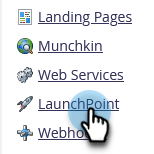
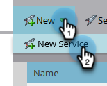

# 將 Vibes 新增為 LaunchPoint 服務 {#add-vibes-as-a-launchpoint-service}

您可以傳送SMS訊息給選擇加入您的Vibes SMS行銷活動的人員，利用SMS活動在Marketo Engage執行個體中原生觸發和篩選行銷活動。 首先，您需要將Vibes新增為LaunchPoint服務。

>[!NOTE]
>
>**需要管理員權限**

>[!AVAILABILITY]
>
>您必須擁有作用中的Vibes帳戶以及Vibes SMS的Adobe授權。 Marketo Vibes SMS原生整合在美國和加拿大提供。 對於其他國家/地區，透過Marketo Webhook的連線可透過[直接連絡Vibes](https://www.vibes.com/talk-to-sales){target="_blank"}來使用。

1. 在「我的Marketo」中，移至&#x200B;**[!UICONTROL Admin]**&#x200B;區域。

   

1. 按一下「**[!UICONTROL LaunchPoint]**」。

   

1. 按一下&#x200B;**[!UICONTROL New]**，然後按&#x200B;**[!UICONTROL New Service]**。

   

1. 輸入顯示名稱，然後在下拉式清單中選取&#x200B;**[!UICONTROL Vibes]**。

   

1. 在[設定]下，輸入您的Vibes [!UICONTROL Username]、[!UICONTROL Password]和[!UICONTROL Company Key] （可在您的Vibes帳戶中找到所有這些Vibes）。 按一下「**[!UICONTROL Create]**」。

   

   新的簡訊服務現在出現在[!UICONTROL Installed Services]清單中。

   

>[!MORELIKETHIS]
>
>[Vibes影片示範](https://vimeo.com/215233767/1ed136adbc){target="_blank"}
