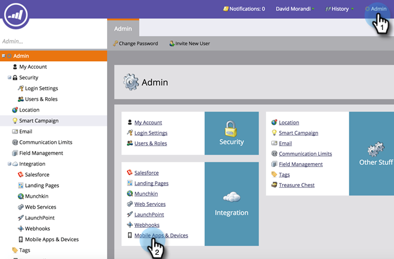

# 驗證移動訪問安全性 {#authenticate-mobile-access-security}

為了改善行動使用者的安全性，Marketo提供兩個新ID:存取金鑰和存取密碼。 這些有助於確保登入您應用程式的使用者實際上就是他們的樣子。

若要啟用ID，您必須取得程式碼，並將其提供給您的IT部門，以便他們能設定安全比對。

>[!PREREQUISITES]
>
>若要啟用此功能，請聯絡支援，並要求「Vespa安全模式」。

1. 在Marketo中，選取 **管理** 按一下 **行動應用程式和裝置**.

   

1. 選取您要啟用安全存取的行動應用程式。

   

1. 向下捲動，在「存取安全性」區段中，按一下 **編輯**.

   

1. 檢查 **啟用安全性** 核取方塊。 按一下 **儲存**.

   

1. 「存取安全性」區域現在會顯示兩個新程式碼。 請務必將這些傳送至您的IT部門。

   
