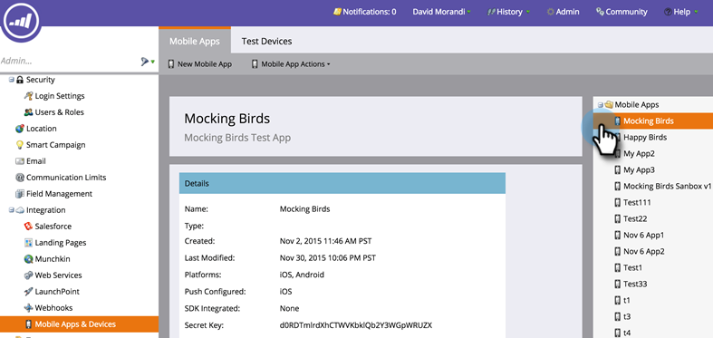
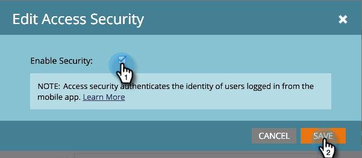

# 驗證行動存取安全性 {#authenticate-mobile-access-security}

為了改善行動使用者的安全性，Marketo提供兩個新ID： [!UICONTROL Access Key]和[!UICONTROL Access Secret]。 這可協助確保登入您應用程式的使用者實際就是他們看似的人。

若要啟用ID，您必須取得代碼，並將代碼提供給您的IT部門，以便他們設定安全比對。

>[!PREREQUISITES]
>
>若要啟用此功能，請聯絡支援並請求「Vespa安全模式」。

1. 在Marketo中，選取&#x200B;**[!UICONTROL Admin]**&#x200B;並按一下&#x200B;**[!UICONTROL Mobile Apps & Devices]**。

   

1. 選取您要啟用安全存取的行動應用程式。

   

1. 向下捲動，在[!UICONTROL Access Security]區段中，按一下&#x200B;**[!UICONTROL Edit]**。

   

1. 核取&#x200B;**[!UICONTROL Enable Security]**&#x200B;核取方塊。 按一下「**[!UICONTROL Save]**」。

   

1. [!UICONTROL Access Security]區域現在會顯示兩個新代碼。 請務必將這些訊息傳送給您的IT部門。

   
