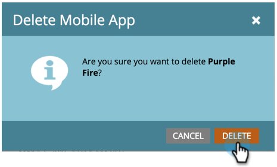

# 刪除行動應用程式 {#delete-mobile-app}

1. 按一下「**[!UICONTROL Admin]**」。

   

1. 選取「**[!UICONTROL Mobile Apps]**」。

   

1. 選取所需的行動應用程式。

   

1. 按一下&#x200B;**[!UICONTROL Mobile App Actions]**&#x200B;並選取&#x200B;**[!UICONTROL Delete App]**。

   

1. 按一下&#x200B;**[!UICONTROL Delete]**&#x200B;確認。

   

太棒了！ 無法再從此行動應用程式傳送推播通知。
