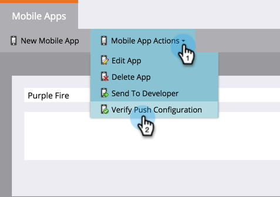

# 驗證推播設定 {#verify-push-configuration}

>[!PREREQUISITES]
>
>您的行動開發人員必須已將Marketo的SDK程式碼新增至行動應用程式。

驗證推送設定，確保一切都已妥善同步。

1. 按一下&#x200B;**[!UICONTROL Admin]**。

   

1. 選取「**[!UICONTROL Mobile Apps]**」。

   

1. 選取所需的行動應用程式。

   

1. 按一下&#x200B;**[!UICONTROL Mobile App Actions]**&#x200B;並選取&#x200B;**[!UICONTROL Verify Push Configuration]**。

   

1. 確認所需的平台已讀取驗證，然後按一下&#x200B;**[!UICONTROL Close]**。

   

準備就緒！ 現在您可以開始傳送推播通知了。

>[!MORELIKETHIS]
>
>[建立推播通知](/help/marketo/product-docs/mobile-marketing/push-notifications/create-a-push-notification.md)
