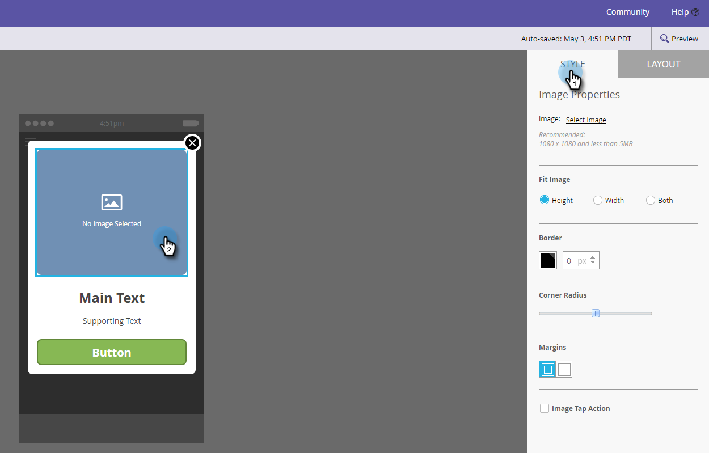

# 新增應用程式內訊息影像 {#add-in-app-message-images}

您可在這裡選擇並自訂應用程式內訊息影像。

1. 選取應用程式內訊息，然後按一下「 **編輯草稿」**。

   

1. 在「版面」索引標籤上，選擇6個範本之一。 有三個快顯視窗和三個全螢幕選項。

   >[!TIP]
   >
   >範本之間有何差異？ 請參 [閱「開始使用之前](/help/marketo/product-docs/mobile-marketing/in-app-messages/creating-in-app-messages/choose-a-layout-for-your-in-app-message.md) ，選擇應用程式內訊息的版面」。

   

1. 按一下「 **樣式** 」標籤，然後按一下範本的影像區域。

   

1. 按一下「 **選取影像**」。

   

1. 從Design Studio中選取您的影像，然後按一下「選 **取」**。

   

   >[!NOTE]
   >
   >影像大小限制為1440 x 2560 px和5MB。

1. 改變主意，想要使用不同的影像？ 沒問題。 按一下 **影像檔** 案名稱旁的X。

   

1. 按一下 **移除**。 現在，你可以選另一個。

   

1. 在影像屬性中，在您想要的影像就位後，選取依照高度、寬度或兩者來配合影像的按鈕。

   

1. （可選）套用影像邊框。 預設設定為 **Off**。 首先，按一下顏色，或在檢色器上輸入十六進位或RGB數字，以選取顏色。

   

1. 按一下箭頭以變更邊框寬度（以像素為單位）。 您會在影像中看到它的變更。

   

1. 使用滑塊選取拐角半徑。 從左到右選擇一個位置：0、4、8、12或16像素。 預設值為8像素（中央）選取範圍。

   

1. 選擇邊界（開啟或關閉）。 **On** 是預設設定。

   

1. 核取方塊以定義影像點選動作。

   

1. 每個平台都有個別的動作（請參閱附註）。

   

1. 按一下每個下拉式清單以顯示選項。 選擇一個。

   

   >[!NOTE]
   >
   >若要點選影像、按鈕或背景的動作，您可以為Apple和Android平台設定不同的動作。 例如，Apple和Android的深層連結處理方式不同。 如果您的訊息只傳送至一個或另一個平台，請將另一個平台保留在預設設定中，或選取「無」 ****。

幹得好！ 現在，您該為應用 [程式內訊息建立文字了](/help/marketo/product-docs/mobile-marketing/in-app-messages/creating-in-app-messages/create-in-app-message-text.md)。

>[!MORELIKETHIS]
>
>* [瞭解應用程式內訊息](/help/marketo/product-docs/mobile-marketing/in-app-messages/understanding-in-app-messages.md)
>* [為您的應用程式內訊息選擇版面](/help/marketo/product-docs/mobile-marketing/in-app-messages/creating-in-app-messages/choose-a-layout-for-your-in-app-message.md)

