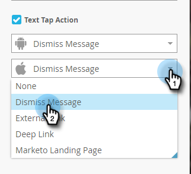

# 建立應用程式內訊息文字 {#create-in-app-message-text}

按一下文字區域，處理您的文字樣式和內容。

1. 按一下「主要文字」以內嵌編輯。

   

1. 按一下文本顏色，或在檢色器上輸入十六進位或RGB號，以選擇文本顏色。

   

1. 按一下箭頭以選取文字大小。

   

   >[!CAUTION]
   >
   >文字大小過大，可能會將內容推到最多三行可見的文字上。

1. 選擇可選類型樣式，以強調： **粗體**, _斜體_，或底線。

   

1. 選擇文本對齊方式：左，中，右。 「居中」是預設值。

   

   >[!NOTE]
   >
   >廣告中轉譯的文字字型是每個平台的標準字型：Apple適用的Helvetica和Android適用的Roboto

1. 核取方塊以選取「文字點選」動作。

   

1. 選取每個平台的點選動作：Apple或Android。

   

   >[!NOTE]
   >
   >若為點選動作，您可以為Apple和Android平台設定不同的動作。 例如，Apple和Android對深層連結的處理方式不同。 如果您的訊息只會傳送至一個平台或另一個平台，您可以將另一個平台保留為預設設定，或選取「無」。

1. 按一下「支援文字」可內嵌編輯。 它的作用與編輯「主要」文本相同，但預設文本大小較小。

   

1. 對於「主要」或「支援」文字，按一下「代號」圖示以新增代號。

   

1. 從下拉式清單中選取「我的代號」、新增預設值，然後按一下 **插入**.

   

   >[!NOTE]
   >
   >只有我的代號可作為選項使用。 如果程式中未設定我的代號，代號下拉式清單將會是空的。

   >[!TIP]
   >
   >請務必考量對象檢視Token時，解析為的字元長度。 留下足夠的空間，以處理可能更長的值，以防止它們被截斷。

   您對已核准應用程式內訊息程式中使用的代號所做的任何變更，在程式暫停並繼續之前，都不會在應用程式內訊息中生效。

你是黃金。 接下來，你需要 [設定應用程式內訊息按鈕](/help/marketo/product-docs/mobile-marketing/in-app-messages/creating-in-app-messages/set-up-the-in-app-message-button.md).

>[!MORELIKETHIS]
>
>* [了解應用程式內訊息](/help/marketo/product-docs/mobile-marketing/in-app-messages/understanding-in-app-messages.md)
>* [選擇應用程式內訊息的版面](/help/marketo/product-docs/mobile-marketing/in-app-messages/creating-in-app-messages/choose-a-layout-for-your-in-app-message.md)

