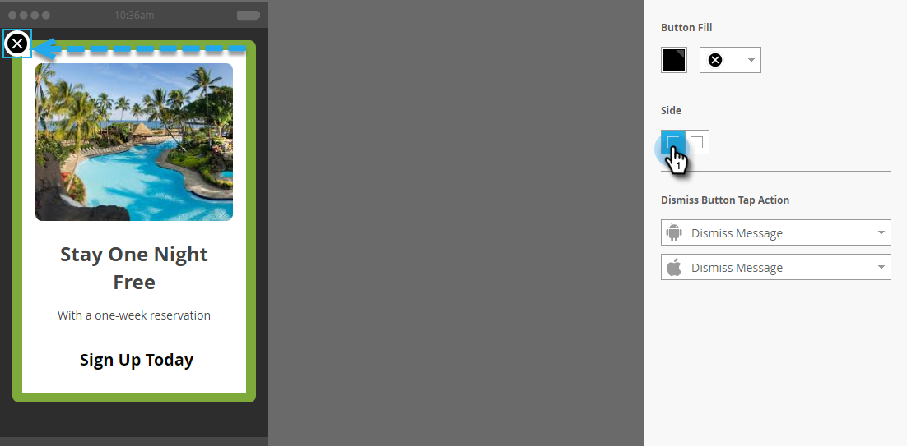

# 設定解除按鈕並核准訊息 {#set-up-the-dismiss-button-and-approve-the-message}

## 設定關閉按鈕屬性  {#configure-dismiss-button-properties}

解除按鈕有許多選項，可讓您依您想要的方式進行設定。

1. 在編輯器中，按一下解除按鈕。

   

1. 如果要變更按鈕顏色，請按一下顏色選取方塊。 按一下顏色，或在檢色器上輸入十六進位或RGB編號來選取顏色。 預設值為黑色。

   

1. 從下拉式清單中選取按鈕設計。 「圓形」按鈕包含全色和漸層選項。

   

   >[!CAUTION]
   >
   >當您從下拉式清單中選取不同的設計時，按鈕顏色可能會在白色背景顯示為白色X。 如果是這樣的話，只要在顏色選取方塊中選取黑色或其他顏色即可顯示白色X。

1. 您可以按一下左角按鈕，將解除按鈕向左移動（右側是預設值）。

   

1. 按一下每個平台的下拉式清單，並選取「解除」按鈕的點選動作。

   

   >[!NOTE]
   >
   >您必須對解除按鈕進行點選動作，因此沒有核取方塊可啟用它。 關閉訊息是預設（且顯而易見的）選項。

## 總結 {#wrap-it-up}

您對圖形、文字和按鈕的所有選取項都已自動儲存。 現在您已準備好完成工作。

1. 若要預覽您的應用程式內訊息，請按一下 **訊息動作** 下拉式清單並選取 **預覽**.

   

1. 在手機或平板電腦上預覽應用程式內訊息，確保訊息正確顯示。

   

1. 如果您滿意應用程式內訊息，請按一下 **核准並關閉**.

   

   >[!NOTE]
   >
   >您也可以選取 **核准並關閉** 直接從「訊息動作」下拉式清單（請參閱步驟1），但為了安全起見，為什麼不先預覽訊息？

1. 若要關閉編輯器而不核准，只需關閉標籤。 它會自動儲存，以便您稍後可以返回並核准。

   

選項眾多，但您現在已收到美觀的應用程式內訊息，可立即開始使用！

現在該是 [傳送您的訊息](/help/marketo/product-docs/mobile-marketing/in-app-messages/sending-your-in-app-message/send-your-in-app-message.md).

>[!MORELIKETHIS]
>
>* [瞭解應用程式內訊息](/help/marketo/product-docs/mobile-marketing/in-app-messages/understanding-in-app-messages.md)
>* [選擇應用程式內訊息的配置](/help/marketo/product-docs/mobile-marketing/in-app-messages/creating-in-app-messages/choose-a-layout-for-your-in-app-message.md)
