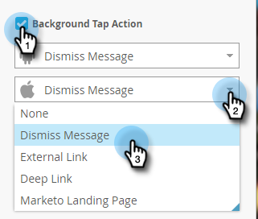

# 設定應用程式內訊息背景{#set-up-the-in-app-message-background}

選取訊息背景是完成應用程式內訊息的重要步驟。

>[!TIP]
>
>對於背景影像，紋理和漸層通常效果最佳。

1. 在編輯器中，按一下背景區域。

   

1. 要設定顏色，請按一下&#x200B;**顏色** ，然後按一下顏色選擇方塊。 按一下顏色或在檢色器上輸入十六進位或RGB代碼，以選取顏色。

   

   >[!NOTE]
   >
   >純白色（預設值）通常是贏家。

1. 如果要使用背景，請按一下&#x200B;**Image**，然後按一下&#x200B;**Select Image**&#x200B;連結。

   

1. 從上傳至Design Studio的檔案中選擇。 按一下&#x200B;**選擇**。

   

   >[!NOTE]
   >
   >影像大小限制為1440 x 2560 px和5MB。

1. 評估結果。 唉呀——也許純色、紋理或漸層效果更好！

   

1. 套用選用的影像邊框。 預設設定為&#x200B;**Off**。 首先，按一下顏色或在檢色器上輸入十六進位或RGB數字，以選取顏色。

   

1. 按一下箭頭以變更邊框寬度。 這個12像素寬的綠色邊框會變更應用程式內訊息的外觀。

   

1. 使用滑塊選取拐角半徑。 從左到右選擇一個位置：0、4、8、12或16像素。 預設值為8像素（中央）選取範圍。

   

1. 勾選方塊以設定背景點選動作（預設為關閉）。

   

   >[!NOTE]
   >
   >若要點選背景動作，您可以為Apple和Android平台設定不同的動作。 例如，Apple和Android的深層連結處理方式不同。 如果您的訊息僅傳送至一個平台或另一個平台，請將另一個平台保留在預設設定中，或選取「無」****。

   [設定「關閉」按鈕](set-up-the-dismiss-button-and-approve-the-message.md)

   >[!MORELIKETHIS]
   >
   >
   >    
   >    
   >    * [瞭解應用程式內訊息](../../../../product-docs/mobile-marketing/in-app-messages/understanding-in-app-messages.md)
   >    * [傳送應用程式內訊息](https://docs.marketo.com/pages/viewpage.action?pageid=10617378)
   >    * [為您的應用程式內訊息選擇版面](choose-a-layout-for-your-in-app-message.md)

要完成這項工作，您的最後一步是。