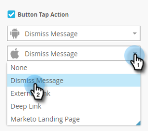

# 設定應用程式內訊息按鈕 {#set-up-the-in-app-message-button}

您可以使用預設按鈕設計、修改它，或上傳您自己的自訂按鈕影像。

1. 按一下按鈕以開啟「樣式」(Style)頁簽進行編輯。

   

1. 若要變更標準按鈕的顏色，請按一下 **顏色** 按鈕。

   

1. 按一下顏色選擇方塊，然後按一下按鈕顏色，或在檢色器上輸入十六進位或RGB號，以選擇按鈕顏色。

   

1. 在下拉式清單中選取形狀。 標準形狀選擇包括銳角、圓角和漸變。

   

1. 如果您想要將自己的影像用於按鈕，請按一下「影像」按鈕，然後按一下 **選擇影像**.

   

1. 選擇影像並按一下 **選擇**.

   

   >[!TIP]
   >
   >為按鈕放置自訂影像時，如果影像已包含文字，請考慮清除放置在該按鈕上的預留位置文字。

1. 按一下顏色選擇方塊，然後按一下字型顏色，或在檢色器上輸入十六進位或RGB號，以選擇字型顏色。

   

1. 按一下箭頭以選擇字型大小。

   

1. 選擇字型樣式以強調： **粗體**, _斜體_，或底線。

   

1. 按一下按鈕文字以內嵌編輯。

   

1. 核取方塊以設定按鈕點選動作。

   

1. 按一下每個平台的下拉式清單，然後選取點選動作。

   

   >[!NOTE]
   >
   >按鈕一律會有點選動作，因此會自動選取「點選動作」核取方塊，並顯示預設訊息「關閉訊息」。

快到了。 最後一步是 [設定應用程式內訊息背景並關閉按鈕](/help/marketo/product-docs/mobile-marketing/in-app-messages/creating-in-app-messages/set-up-the-in-app-message-background.md).

>[!MORELIKETHIS]
>
>* [了解應用程式內訊息](/help/marketo/product-docs/mobile-marketing/in-app-messages/understanding-in-app-messages.md)
>* [選擇應用程式內訊息的版面](/help/marketo/product-docs/mobile-marketing/in-app-messages/creating-in-app-messages/choose-a-layout-for-your-in-app-message.md)

