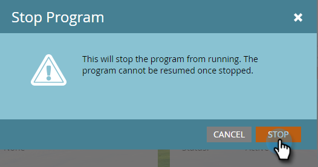

# 核准您的應用程式內訊息 {#approve-your-in-app-message}

您必須先核准傳送，應用程式內訊息才會傳出。

1. 如果一切正常，請按一下 **核准並啟動**.

   

   >[!NOTE]
   >
   >如果傳送程式的任何部分不完整（例如，應用程式內訊息未核准），則會出現警告訊息，指出需要注意的區域。 請修正此問題，您應該會在步驟2看到訊息。

1. 按一下 **核准並啟動**.

   

1. 如果您使用自訂欄位，Marketo可能需要更長的時間才能執行，並會改為顯示此訊息。

   

1. 訊息現在已啟用。

   

   >[!NOTE]
   >
   >您的程式中的訪客通常需要15到30分鐘才能看到已核准的應用程式內訊息。 請記住，如果您使用自訂欄位，這可能需要幾個小時或更長時間。

   您可以暫停或停止作用中的程式，但這兩個選項之間有很大差異。

1. 按一下 **暫停程式** 如果您需要停止程式一段時間，但稍後再繼續。 它將會變更為 **已暫停** 狀態。

   

   >[!NOTE]
   >
   >暫停的原因可能是為了停止一段時間，或者如果您想要修改訊息或調整排程。 不過，您無法變更為其他訊息，只能編輯現有訊息。

1. 如果要讓暫停的程式繼續執行，請按一下 **繼續計畫**.

   

1. 若要完全停止程式，請按一下 **停止程式**.

   

1. 如果您確定要停止程式，請按一下 **停止**.

   

   >[!NOTE]
   >
   >當您停止程式時，它不再執行且無法繼續。 若要再次執行，您必須重新建置。 因此，在按一下之前，請確定您已完成程式 **停止程式**！

## 應用程式內儀表板 {#in-app-dashboard}

程式執行後，您可以使用應用程式內儀表板監控其效能，在您核准程式後會自動顯示。 若要返回程式，請按一下右上方的連結，然後選取 **控制面板**.

僅此而已，大家！
