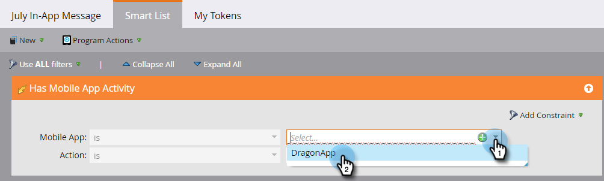

# 設定您的應用程式內訊息對象 {#set-your-in-app-message-audience}

第一步是決定應由誰接收您的應用程式內訊息。 你需要設定智慧清單。

1. 按一下 **編輯智慧清單**.

   

1. 在智慧清單中，會自動填入「具有行動應用程式活動」觸發器。 按一下下拉式清單，然後選取您要放置訊息的應用程式。

   

   >[!NOTE]
   >
   >應用程式內訊息程式目前不支援「行動應用程式」欄位的多個值。

1. **應用程式開啟** 是預設的「動作」設定，但您可以選取您已設定的任何自訂事件。

   

   >[!NOTE]
   >
   >預設觸發器（應用程式開啟）以及開發人員新增至程式碼的任何自訂觸發器會自動顯示在動作選取器中。 如果遺失自訂事件，請洽詢您的開發人員，確定他們已將自訂事件新增至應用程式。 請注意，自訂事件編碼和核准程式可能需要一些時間才能完成。 請參閱 [這篇文章](/help/marketo/product-docs/mobile-marketing/admin/before-you-create-push-notifications-and-in-app-messages.md) 以取得更多資訊。

1. 限制適用於 **有行動應用程式活動** 需要時觸發。

   

1. 您可以將篩選器新增至智慧清單，以限制接收您應用程式內訊息的使用者。 在此範例中，使用 **贏取日期** 篩選器中，只會傳送2016年6月9日取得的人員，而應用程式內訊息。

   

1. 返回應用程式內訊息控制面板。 在下拉式清單中設定顯示限制。

   

   >[!NOTE]
   >
   >預設顯示限制為 **每個工作階段一次**. 如果您希望收件者回應後訊息停止顯示，請選取 **每次被點選之前**. 如果每次都應顯示，無論收件者做什麼，請挑選 **每次**.

   

幹得好！ 你有你的對象。 你贏了藍色的勾號。

結束時間 [選取您的應用程式內訊息](/help/marketo/product-docs/mobile-marketing/in-app-messages/sending-your-in-app-message/select-your-in-app-message.md)!
