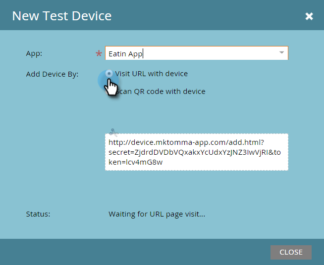
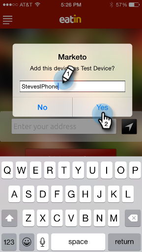

# 添加新測試設備{#adding-a-new-test-device}

將新的測試裝置新增至推播通知很簡單。

>[!NOTE]
>
>**需要管理員權限**

1. 按一下「**管理員**」，然後按一下「行動應用程式&#x200B;**」連結。**

   

1. 按一下&#x200B;**測試設備**&#x200B;頁籤和&#x200B;**新測試設備**。

   

1. 選取您的應用程式。

   

1. 您有兩種方式可將裝置連接至應用程式。

   使用第一個選項，只需從欄位複製URL，然後以電子郵件或簡訊傳送至您的裝置。 從裝置點選URL。

   

   或者，透過第二個選項，按一下第二個按鈕，然後使用您的裝置掃描QR Code。

   

1. 應用程式隨即開啟。 命名設備並點選&#x200B;**是**。

   

   成功！

   

1. 狀態更新顯示設備已添加。 恭喜！

   
