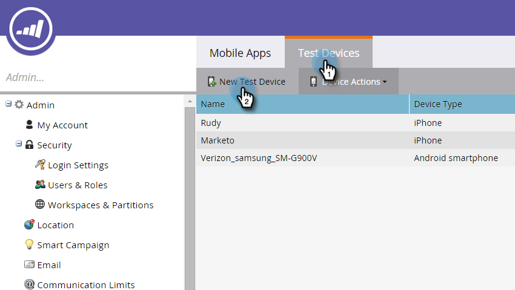

# 添加新測試設備 {#adding-a-new-test-device}

新增測試裝置以推播通知很容易。

>[!NOTE]
>
>**需要管理權限**

1. 按一下 **管理** 然後 **行動應用程式** 連結。

   

1. 按一下 **測試裝置** 標籤和 **新測試設備**.

   

1. 選取您的應用程式。

   

1. 您有兩種方式可將裝置連接至應用程式。

   使用第一個選項，只需從欄位複製URL，然後以電子郵件或簡訊傳送至裝置即可。 從裝置點選URL。

   

   或者，使用第二個選項，按一下第二個按鈕，使用您的裝置掃描QR碼。

   

1. 應用程式隨即開啟。 命名裝置並點選 **是**.

   

   成功!

   

1. 已新增顯示裝置的狀態更新。 恭喜您！

   
