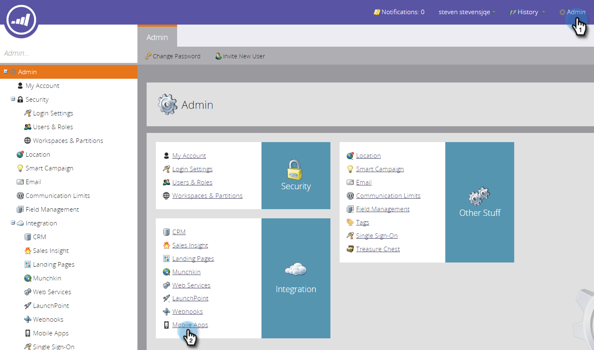

# 新增新的測試裝置 {#adding-a-new-test-device}

可以輕鬆新增要推送通知的新測試裝置。

>[!NOTE]
>
>**需要管理員許可權**

1. 按一下&#x200B;**[!UICONTROL Admin]**，然後按一下&#x200B;**[!UICONTROL Mobile Apps]**&#x200B;連結。

   

1. 按一下「**[!UICONTROL Test Devices]**」索引標籤和&#x200B;**[!UICONTROL New Test Device]**。

   

1. 選取您的應用程式。

   

1. 您有兩種方式可將裝置連線至應用程式。

   使用第一個選項時，只需從欄位複製URL，並以電子郵件或文字訊息傳送至您的裝置即可。 從裝置，點選URL。

   

   或者，使用第二個選項，按一下第二個按鈕，並使用裝置掃描QR碼。

   

1. 應用程式隨即開啟。 命名裝置並點選&#x200B;**[!UICONTROL Yes]**。

   

   成功！

   

1. 狀態會更新，以顯示已新增的裝置。 恭喜！

   
