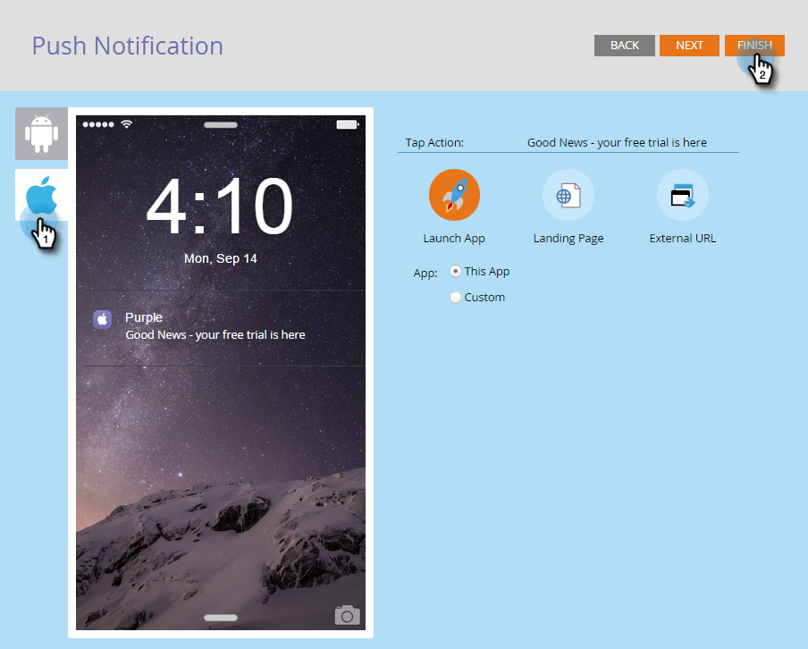

# 設定行動推播通知 {#configure-mobile-push-notification}

1. 移至&#x200B;**[!UICONTROL Marketing Activities]**&#x200B;區域。

   

1. 選取您的推送資產，然後按一下&#x200B;**[!UICONTROL Edit Draft]**。

   

1. 在&#x200B;**設定**&#x200B;中，選取您想要的應用程式。 Android和Apple平台預設為啟用。

   

   >[!NOTE]
   >
   >如果您的推送訊息僅套用至一個平台(例如iOS)，您可以手動將其選取器滑動至「**已停用**」以排除另一個平台。

1. 按一下「**[!UICONTROL Next]**」。

   

1. 輸入訊息文字或選取權杖圖示以新增權杖（在此編輯器中，權杖的格式為[，因為通常是](/help/marketo/product-docs/demand-generation/landing-pages/personalizing-landing-pages/tokens-overview.md) — 您可以使用多個權杖）。 選取&#x200B;**點選動作**。

   

   >[!NOTE]
   >
   >如果平台已啟用，它會出現在電話熒幕顯示的左側。 選取時，它會以彩色顯示。

   >[!NOTE]
   >
   >有三種型別的[!UICONTROL Tap Actions]：
   >
   >**啟動應用程式** - **此應用程式**&#x200B;會在您點選通知時開啟應用程式的首頁。 **自訂**&#x200B;會使用深層連結來開啟您應用程式的其他區域或您有連結的任何其他應用程式（如需詳細資訊，請參閱下方的[深層連結URI](#deep-link-uris)）。
   >
   >**[!UICONTROL Landing Page]** — 將您導向至指定的Marketo登陸頁面。
   >
   >**[!UICONTROL External URL]** — 將您帶往非Marketo登陸頁面。

1. 若要插入自訂點選動作的深層連結，請選取&#x200B;**自訂**，然後在欄位中輸入[深層連結URI](#deep-link-uris)。

   

   >[!NOTE]
   >
   >訊息和點選動作在兩個平台上看起來都一樣。

1. 僅適用於iOS，核取此核取方塊以指示應用程式在訊息到達時播放音效。 Android會自動播放音效。

   

1. 預覽其他平台並按一下&#x200B;**[!UICONTROL Finish]**。

   

1. 按一下「**[!UICONTROL Approve and Close]**」。

   

恭喜！現在推播通知已準備好傳送。

## 深層連結URI {#deep-link-uris}

當訂閱者按一下推送訊息中的按鈕時，可以將其帶至應用程式的首頁，或直接帶至應用程式內的特定頁面。 深層連結是對應用程式中特定頁面的唯一參照，看起來很像網站連結。

深層連結URI由三部分組成：配置名稱、路徑和識別碼。 在以下範例中，「myappname」是配置。 「products」是路徑，而「purple-shirt」是識別碼。 客戶點選時，系統會將它們明確帶入應用程式產品頁面中的紫色襯衫專案。

也就是說，您應用程式的深層連結結構可能與上述範例不同。 您的開發人員在定義深層連結URI時有許多選項，因此請要求您的開發人員將您有意使用的頁面的URI （連結）傳送給您。 這可確保您在推送訊息中輸入的URI會指向正確的位置。 您的開發人員可以[在這裡找到更多資訊](https://experienceleague.adobe.com/zh-hant/docs/marketo-developer/marketo/mobile/enabling-deep-links-in-your-app)。

>[!MORELIKETHIS]
>
>[傳送行動推播通知](/help/marketo/product-docs/mobile-marketing/push-notifications/send-a-mobile-push-notification.md)
