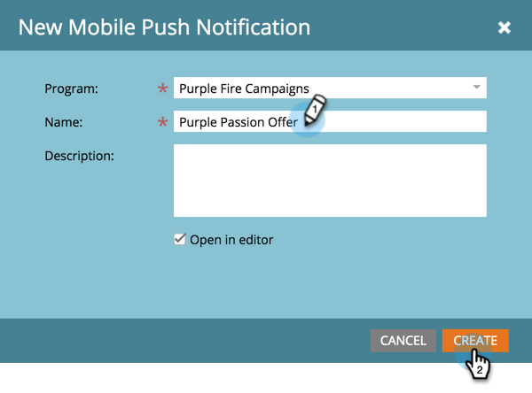

# 建立推播通知 {#create-a-push-notification}

建立推播通知相當容易。 不過在開始之前，您必須讓Marketo管理員和Mobile Apps開發人員設定一些您執行工作時所需的專案。 如需詳細資訊，請參閱[瞭解推播通知](/help/marketo/product-docs/mobile-marketing/push-notifications/understanding-push-notifications.md)。

1. 前往「**[!UICONTROL Marketing Activities]**」區域。

   

1. 尋找並選取您的程式。

   

1. 在&#x200B;**[!UICONTROL New]**&#x200B;底下，按一下&#x200B;**[!UICONTROL New Local Asset]**。

   

1. 選取「**[!UICONTROL Push Notification]**」。

   

1. 輸入&#x200B;**推播通知名稱**&#x200B;並按一下&#x200B;**[!UICONTROL Create]**。

   

   真貼心！ 現在已建立推播通知，接著請[將其裝飾](/help/marketo/product-docs/mobile-marketing/push-notifications/configure-mobile-push-notification.md)。
